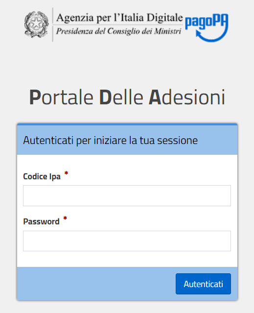
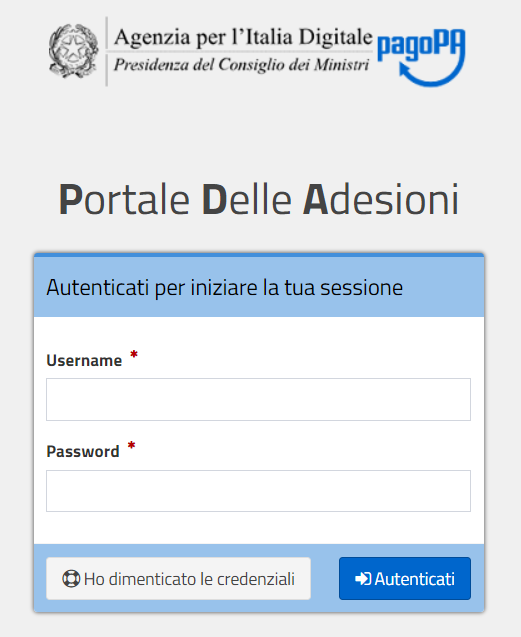


|image0|

+-------------------------------------------------+
| **Portale delle Adesioni Manuale Utente**       |
|                                                 |
| **Versione 2.2 – 31 luglio 2018**               |
+-------------------------------------------------+

2. ACCESSO AL PORTALE
=====================

Il Portale delle Adesioni ha due distinte modalità di accesso: la prima
prevede l’utilizzo di credenziali non nominali, costituite da uno
*username* corrispondente al codice IPA dell’Ente Creditore e da una
*password* generata dal sistema; la seconda prevede l’utilizzo di una
*username* nominale e di una *password*.

2.1 Accesso con credenziali non nominali
----------------------------------------

La modalità di accesso con credenziali non nominali è riservata:

a - Agli Incaricati degli Enti non ancora aderenti che devono accreditare
il proprio Referente dei Pagamenti;

b - Agli Incaricati degli Enti già aderenti che devono sostituire il
Referente dei Pagamenti precedentemente accreditato;

c - Ai Referenti dei Pagamenti di Enti Creditori che, avendo aderito
prima dell’esistenza del Portale, devono completare i propri dati.

Tutti i soggetti elencati nei punti precedenti ricevono dal Portale
delle Adesioni, sulla PEC dell’Ente, le credenziali non nominali con le
quali accedere **(una sola volta)** all’indirizzo
`https://portal.pagopa.gov.it/pda-fa-portal/login <https://portal.pagopa.gov.it/pda-fa-portal/login>`__
per utilizzare le funzionalità che consentono di portare a compimento le
azioni indicate ai punti a), b) e c).

|image1|

**Figura 1 – Accesso con credenziali non nominali**

2.2 Accesso con credenziali nominali
------------------------------------

La modalità di accesso con credenziali nominali è riservata:

a - Agli Amministratori AgID;

b - Agli Operatori del Nodo dei Pagamenti-SPC;

c - Ai Referenti dei Pagamenti che devono inviare ad AgID la Lettera di
Adesione a pagoPA, gestire le connessioni dell’Ente Creditore a
pagoPA e comunicare gli IBAN di accredito;

d - Ai Referenti Tecnici che devono comunicare tutte le informazioni
necessarie alla configurazione e all’attivazione dell’Ente Creditore
sul Nodo dei Pagamenti e svolgere una serie di attività
successivamente descritte in dettaglio.

I Referenti Pagamenti e i Referenti Tecnici che, a seguito di nomina,
ricevono dal Portale delle Adesioni tramite mail le credenziali
nominali, devono accedere alla sezione del Portale disponibile al
seguente indirizzo:

`https://portal.pagopa.gov.it/pda-portal/admin/login <https://portal.pagopa.gov.it/pda-portal/admin/login>`_

|image2|

**Figura 2 – Accesso con credenziali nominali**

Il soggetto che accede per la prima volta al Portale con le credenziali
nominali ricevute dal sistema sarà invitato ad impostare una nuova
password.

2.3 Funzionionalità disponibili in base alla modalità di accesso al Portale
----------------------------------------------------------------------------

Il Portale delle Adesioni mette a disposizione funzionalità differenti in base 
alla modalita con cui l'utente accede; ad esempio, in caso di accesso con 
**credenziali non nominali** mette a disposizione dei
profili abilitati le funzionalità indicate in Tabella 2.

+--------------------+-------------+-----------+-------------+-----------+-----------+
| **Funzionalità**   | **Profili**                                                   |
+====================+=============+===========+=============+===========+===========+
|                    | **AgID**    | **Nodo**  | **IEC**     | **RP**    | **RT**    |
+--------------------+-------------+-----------+-------------+-----------+-----------+
| Accreditamento     |             |           | X           |           |           |
| del                |             |           |             |           |           |
| Referente          |             |           |             |           |           |
| dei                |             |           |             |           |           |
| Pagamenti          |             |           |             |           |           |
+--------------------+-------------+-----------+-------------+-----------+-----------+
| Sostituzione di un |             |           | X           |           |           |
| Referente dei      |             |           |             |           |           |
| Pagamenti          |             |           |             |           |           |
+--------------------+-------------+-----------+-------------+-----------+-----------+
| Completamento dei  |             |           | X           |           |           |
| dati del           |             |           |             |           |           |
| Referente dei      |             |           |             |           |           |
| Pagamenti          |             |           |             |           |           |
+--------------------+-------------+-----------+-------------+-----------+-----------+
**Tabella 2 – Matrice Funzionalità/Profili per accesso con credenziali non nominali**

.. |image0| image:: media/header.png
   :width: 3.93701in
   :height: 0.89306in

