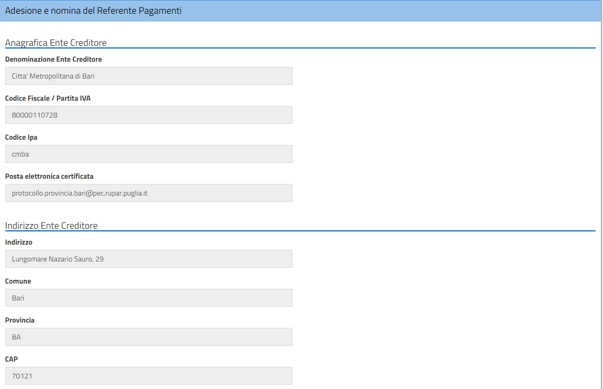
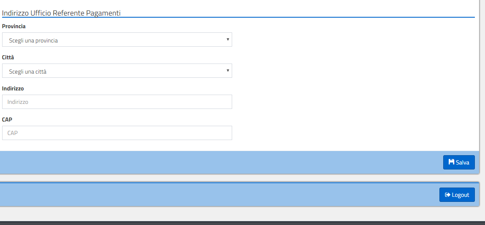
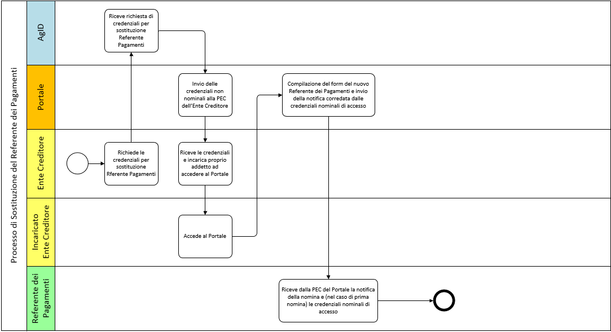

|image0|

+-------------------------------------------------+
| **Portale delle Adesioni Manuale Utente**       |
|                                                 |
| **Versione 2.2 – 31 luglio 2018**               |
+-------------------------------------------------+

3. FUNZIONALITÀ ACCESSIBILI CON CREDENZIALI NON NOMINALI
========================================================

I soggetti che hanno ricevuto le credenziali non nominali possono
utilizzare le funzionalità di:

-  Accreditamento del Referente dei Pagamenti (per EC non ancora
   aderenti a pagoPA);

-  Sostituzione di un Referente dei Pagamenti precedentemente nominato
   (per Enti già aderenti);

-  Completamento dei dati del Referente dei Pagamenti.

3.1 Accreditamento del Referente dei Pagamenti dell’Ente Creditore (IEC)
------------------------------------------------------------------------

La prima operazione necessaria per l’adesione a pagoPA è l’inserimento
delle informazioni relative al Referente dei Pagamenti designato
dall’Ente Creditore. Nella Figura 3 è descritto il relativo processo.

|image3|

**Figura 3 - Processo di accreditamento del Referente dei Pagamenti**

Il processo di accreditamento schematizzato in Figura 3 si articola nei
seguenti passi:

**[a]** L’Ente Creditore riceve via PEC da AgID la mail contenente le
credenziali di primo accesso e incarica un proprio addetto [1]_ a
eseguire l'attività di accreditamento del Referente dei Pagamenti.
AgID presume che tale operazione sia compiuta per nome e per conto
del legale rappresentante dell’Ente;

**[b]** Il soggetto incaricato dall’Ente Creditore accede al Portale delle
Adesioni e si autentica inserendo le credenziali ricevute;

**[c]** Il soggetto incaricato compila il modulo di designazione del
Referente dei Pagamenti e completa l'operazione solo dopo aver
indicato i dati obbligatori;

**[d]** Il Portale delle Adesioni genera le credenziali per il Referente dei
Pagamenti accreditato dall’Ente e le invia all’indirizzo di posta
elettronica indicato nel modulo di designazione;

**[e]** Il Referente dei Pagamenti “accreditato”, ricevute tali credenziali,
può accedere al Portale e completare il processo di adesione
dell'Ente.

Uno stesso soggetto può essere designato come Referente dei Pagamenti da
uno o più Enti Creditori e riceverà le proprie credenziali solo al
momento della” prima” nomina; per le successive riceverà solo una mail
di notifica [2]_.

3.1.1 Compilazione del modulo di designazione del Referente dei Pagamenti
~~~~~~~~~~~~~~~~~~~~~~~~~~~~~~~~~~~~~~~~~~~~~~~~~~~~~~~~~~~~~~~~~~~~~~~~~

Completata la fase di login, l’Ente Creditore (ovvero il soggetto
incaricato dall’Ente) accede alla pagina del Portale che contiene le
istruzioni di primo accesso ed il *form* che consente di inserire i dati
del Referente dei Pagamenti che intende designare.

Dopo una prima sezione che presenta informazioni (non modificabili)
relative all’Ente Creditore reperite dall’Indice delle Pubbliche
Amministrazioni, è possibile inserire le informazioni indispensabili a
identificare il Referente dei Pagamenti e necessarie a generare le sue
credenziali di accesso al Portale. Sarà possibile anche inserire
informazioni complementari (non obbligatorie) riguardanti l’ubicazione
dell’ufficio del Referente dei Pagamenti.

Nelle figure che seguono si possono osservare le sezioni relative
all’Ente Creditore e ai dati (obbligatori o no) relativi al Referente
dei Pagamenti che si intende designare.

|image4|

**Figura 4 – Informazioni dell’Ente Creditore**

|image5|

**Figura 5 - Informazioni del Referente dei Pagamenti (dati personali)**

|image6|

**Figura 6 - Informazioni del Referente dei Pagamenti (dati dell’ufficio)**

Di seguito riportiamo l'elenco di dettaglio delle informazioni relative
al Referente dei Pagamenti:

+---------------------+------------------------------+------------------+----------------------+
| **Nome campo**      | **Contenuto**                | **Obbligatorio** | **Controlli**        |
|                     |                              | **(SI/NO)**      |                      |
+=====================+==============================+==================+======================+
| Nome                | Nome del Referente dei       | SI               | Presenza del dato    |
|                     | Pagamenti                    |                  |                      |
+---------------------+------------------------------+------------------+----------------------+
| Cognome             | Cognome del Referente dei    | SI               | Presenza del dato    |
|                     | Pagamenti                    |                  |                      |
+---------------------+------------------------------+------------------+----------------------+
| Codice Fiscale      | Codice Fiscale del           | SI               | Validità formale del |
|                     | Referente dei Pagamenti      |                  | check-digit          |
+---------------------+------------------------------+------------------+----------------------+
| Qualifica/Ruolo     | Qualifica o ruolo del        | NO               | Nessuno              |
|                     | Referente dei Pagamenti      |                  |                      |
|                     | all'interno dell'ente.       |                  |                      |
|                     | Nel caso il Referente dei    |                  |                      |
|                     | Pagamenti non faccia         |                  |                      |
|                     | parte dell'organizzazione    |                  |                      |
|                     | indicare "ESTERNO"           |                  |                      |
+---------------------+------------------------------+------------------+----------------------+
| Mail                | Indirizzo di posta           | SI               | Validità formale     |
|                     | elettronica (semplice o PEC) |                  | dell'indirizzo       |
|                     | del Referente dei            |                  |                      |
|                     | Pagamenti                    |                  |                      |
+---------------------+------------------------------+------------------+----------------------+
| Recapito            | Indicare il numero di        | NO               |                      |
| telefonico          | telefono fisso del Referente |                  |                      |
|                     | dei Pagamenti                |                  |                      |
+---------------------+------------------------------+------------------+----------------------+
| Recapito            | Indicare il numero di        | NO               | Nessuno              |
| cellulare           | telefono mobile del          |                  |                      |
|                     | Referente dei Pagamenti      |                  |                      |
+---------------------+------------------------------+------------------+----------------------+
| Amm.ne/Ente/Società | Nel caso in cui il Referente | NO               | Nessuno              |
|                     | dei Pagamenti non appartenga |                  |                      |
|                     | all'organizzazione dell'Ente |                  |                      |
|                     | Creditore, indicare          |                  |                      |
|                     | l'organizzazione di cui il   |                  |                      |
|                     | soggetto fa parte            |                  |                      |
+---------------------+------------------------------+------------------+----------------------+
| Provincia           | Indicare la provincia nella  | NO               | Nessuno              |
|                     | quale si trova l'Ufficio del |                  |                      |
|                     | Referente dei Pagamenti      |                  |                      |
+---------------------+------------------------------+------------------+----------------------+
| Città               | Indicare la città nella      | NO               | Nessuno              |
|                     | quale si trova l'Ufficio del |                  |                      |
|                     | Referente dei Pagamenti      |                  |                      |
+---------------------+------------------------------+------------------+----------------------+
| Indirizzo           | Indicare l'indirizzo dove è  | NO               | Nessuno              |
|                     | ubicato l'Ufficio del        |                  |                      |
|                     | Referente dei Pagamenti      |                  |                      |
|                     |                              |                  |                      |
+---------------------+------------------------------+------------------+----------------------+
| CAP                 | Indicare il Codice di        | NO               | Nessuno              |
|                     | Avviamento Postale relativo  |                  |                      |
|                     | all'indirizzo dove è ubicato |                  |                      |
|                     | l'Ufficio del Referente dei  |                  |                      |
|                     | Pagamenti                    |                  |                      |
+---------------------+------------------------------+------------------+----------------------+

Una volta inserite almeno le informazioni obbligatorie richieste, il
soggetto incaricato dall’Ente Creditore completa la designazione del
Referente dei Pagamenti premendo il pulsante “Salva”.

Al completamento del processo di designazione del Referente dei
Pagamenti, il Portale delle Adesioni invia al suo indirizzo di posta
elettronica una mail contenente le credenziali di accesso al Portale.

3.2 Sostituzione del Referente dei Pagamenti (IEC)
--------------------------------------------------

Qualora un Ente Creditore aderente a pagoPA si trovi nella necessità di
designare un nuovo Referente dei Pagamenti in sostituzione di quello
precedentemente nominato, deve eseguire un processo analogo a quello
descritto in precedenza.

|image7|

**Figura 7 - Processo di sostituzione del Referente dei Pagamenti**

Il processo di sostituzione, schematizzato in Figura 7, si articola nei
seguenti passi:

**[a]** L’Ente Creditore invia alla casella di posta elettronica
portalepagopa@agid.gov.it la richiesta di credenziali di “primo
accesso” indicando nell’oggetto della mail la causale: “\ **Richiesta
credenziali di accesso per sostituzione Referente dei Pagamenti**\ ”
e nel corpo dell’email la PEC e il codice IPA dell’Ente Creditore;

**[b]** In risposta a tale richiesta l’Ente Creditore riceve da AgID via PEC
la mail contenente le credenziali di “primo accesso” e incarica un
proprio addetto [3]_ a eseguire l'attività di sostituzione del
Referente dei Pagamenti. AgID presume che tale operazione sia
compiuta per nome e per conto del legale rappresentante dell’EC;

**[c]** Il soggetto incaricato dall’EC accede al Portale delle
Adesioni e si autentica inserendo le credenziali ricevute;

**[d]** Il soggetto incaricato compila il modulo di designazione del
Referente dei Pagamenti e, premendo il pulsante “Salva”, completa l'operazione;

**[e]** In modo automatico, il Portale delle Adesioni genera le credenziali
di accesso e le invia da
`portalepagopa@pcert.agid.gov.it <mailto:portalepagopa@pcert.agid.gov.it>`__
all’indirizzo di posta elettronica del nuovo Referente dei Pagamenti
indicato nel modulo di designazione;

**[f]** Il nuovo Referente dei Pagamenti “accreditato”, ricevute tali
credenziali, può accedere al Portale e completare il processo di
sostituzione.

È opportuno sottolineare che sarà abilitato ad operare sempre un solo
Referente dei Pagamenti per un Ente Creditore: il processo di
sostituzione prevede che il “vecchio” Referente dei Pagamenti continuerà
ad operare fino all’invio delle credenziali al Referente dei Pagamenti
designato a sostituirlo.

3.3 Completamento dei dati obbligatori del Referente dei Pagamenti (IEC)
------------------------------------------------------------------------

La designazione di un Referente dei Pagamenti attraverso il Portale
delle Adesioni prevede che alcune informazioni debbano essere compilate
obbligatoriamente. Alcuni Enti Creditori hanno però aderito a pagoPA
prima dell’attivazione del Portale e potrebbero non aver indicato alcuni
dei dati (ad esempio il Codice Fiscale) che oggi sono assolutamente
indispensabili per attribuire al Referente dei Pagamenti designato le
credenziali di accesso al Portale.

Il Portale consente di sanare questa situazione rendendo disponibile una
funzione che permette ai soli Enti Creditori che abbiano aderito a
pagoPA prima dell’attivazione del Portale, di completare i dati senza
l’obbligo di sottoscrivere una nuova Lettera di Adesione. La procedura,
anche in questo caso particolare, utilizza gli stessi *form* descritti
in precedenza e utilizzati per designare il Referente dei Pagamenti. Al
termine della procedura il Referente dei Pagamenti designato riceverà da
AgID le credenziali per accedere al Portale delle Adesioni.

.. [1]
   Di norma, ma non necessariamente, la persona che in seguito svolgerà
   il ruolo di Referente dei Pagamenti.

.. [2]
   Senza password temporanea in quanto l’utenza del Referente dei
   Pagamenti è già attiva nel sistema.

.. [3]
   Di norma, ma non necessariamente, la persona che in seguito svolgerà
   il ruolo di Referente dei Pagamenti.

.. |image0| image:: media/header.png
   :width: 3.93701in
   :height: 0.89306in

