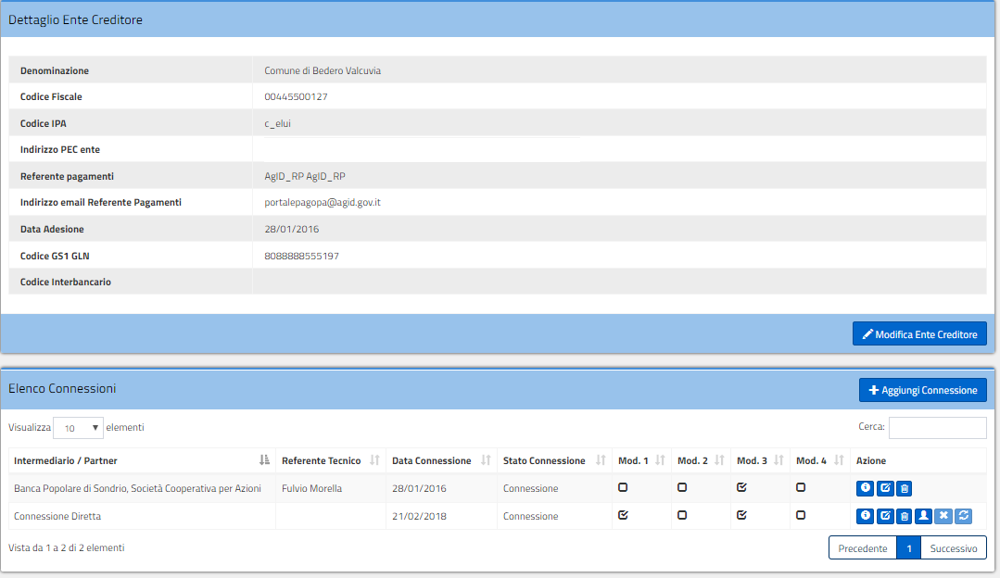

|image0|

+-------------------------------------------------+
| **Portale delle Adesioni Manuale Utente**       |
|                                                 |
| **Versione 2.2 – 31 luglio 2018**               |
+-------------------------------------------------+

4. FUNZIONALITÀ ACCESSIBILI CON CREDENZIALI NOMINALI
====================================================

I soggetti che hanno ricevuto le credenziali nominali hanno accesso a
una serie di funzionalità che cambiano in base al tipo di profilo che ha
effettuato l’accesso: Amministratore AgID (AgID), Operatore Nodo dei
Pagamenti-SPC (Nodo), Incaricato Ente Creditore (IEC), Referente dei
Pagamenti (RP) e Referente Tecnico (RT).

4.1 Home
--------

La schermata iniziale del Portale mostra dati sintetici relativi a:

-  Enti creditori aderenti: Enti che hanno finalizzato il processo di
   adesione a pagoPA attraverso il Portale delle Adesioni;

-  Enti creditori in corso di attivazione: Enti che stanno completando
   il processo di adesione a pagoPA attraverso al Portale delle
   Adesioni;

-  Enti Creditori attivi: Enti aderenti a pagoPA che hanno almeno una
   connessione in esercizio.

Dalla Home del Portale delle Adesioni è anche possibile scaricare
l’ultima versione disponibile del manuale utente in formato PDF.

|image12|

**Figura 8 - Portale delle Adesioni – Home page (profilo Amministratore AgID)**

4.2 Utenti
----------

Gli utenti del PdA si suddividono in quattro gruppi:

-  Amministratori AgID;

-  Operatori del Nodo dei Pagamenti-SPC

-  Referenti Pagamenti;

-  Referenti Tecnici.

Dalla voce di menu Utenti è possibile consultare e, qualora si posseggano i privilegi necessari,
modificare gli utenti del sistema. Selezionando un gruppo, viene visualizzato l’elenco degli utenti
registrati sul Portale appartenenti a quel gruppo (Figura 9).

|image13|

**Figura 9 - Elenco degli Amministratori AgID**

La colonna “Abilitato” indica se l'utente è abilitato o meno
ad accedere al Portale mentre nella colonna “Azioni” è presente una
serie di tasti che consentono di accedere alle funzionalità di seguito
elencate:

-  “Dettaglio”: permette di visualizzare i dettagli dell’utente
   selezionato;

-  “Modifica”: permette di modificare alcuni dati dell’utente
   selezionato;

-  “Sblocca”: consente di sbloccare l’account di un utente che è stato
   bloccato in automatico dal sistema a seguito di un numero di
   tentativi errati di accesso superiore al limite previsto;

-  “Abilita”: consente di abilitare un utente disabilitato;

-  “Disabilita”: consente di disabilitare un utente abilitato;

-  “Elimina”: consente di eliminare l’utente selezionato. Questa
   operazione è consentita solo se l’utente non è abilitato;

-  “Sostituisci”: consente di sostituire il Referente dei Pagamenti con
   un altro soggetto selezionabile tra quelli censiti sul Portale (vedi
   Figura 10). Tutti gli Enti creditori associati al Referente dei
   Pagamenti sostituito verranno ereditati dal nuovo.

L’Amministratore AgID può modificare qualsiasi utente; il Referente
Pagamenti e il Referente Tecnico possono modificare solo le informazioni
relative al proprio account. Tutte le informazioni sono modificabili ad
eccezione del nome e cognome, dello username e del codice fiscale.

|image14|

**Figura 10 – Form per la sostituzione del Referente Pagamenti**

4.3 Credenziali primo accesso
-----------------------------

La voce di menu “Credenziali Primo Accesso” consente ad AgID la gestione
delle credenziali non nominali di primo accesso.

4.3.1 Visualizzazione Credenziali Primo Accesso inviate (AgID)
~~~~~~~~~~~~~~~~~~~~~~~~~~~~~~~~~~~~~~~~~~~~~~~~~~~~~~~~~~~~~~

La funzionalità consente di visualizzare l’elenco degli Enti a cui sono
state inviate credenziali di primo accesso.

|image15|

**Figura 11 – Visualizzazione Credenziali Primo Accesso inviate**

Nella colonna “Tipologia Invio” viene indicato il fine per cui sono
state inviate le credenziali di accesso come meglio spiegato nel
successivo paragrafo.

4.3.2 Aggiunta di un Ente Creditore per invio credenziali primo accesso (AgID)
~~~~~~~~~~~~~~~~~~~~~~~~~~~~~~~~~~~~~~~~~~~~~~~~~~~~~~~~~~~~~~~~~~~~~~~~~~~~~~

La funzionalità “Aggiungi Ente” consente ad AgID, attraverso la
compilazione del *form* mostrato in Figura 12, di aggiungere un Ente
a cui inviare le credenziali di primo accesso. L’invio è
previsto nelle seguenti 3 situazioni:

-  “Conferma Dati Rp”: il Referente Pagamenti ha un profilo incompleto
   che non gli permette di accedere al Portale;

-  “Nuova Adesione”: l’Ente Creditore ha richiesto di accedere al
   Portale per aderire a pagoPA;

-  “Sostituzione Rp”: l’Ente Creditore ha richiesto di sostituire il
   Referente Pagamenti.

|image16|

**Figura 12 – Aggiunta di un Ente Creditore per invio credenziali primo accesso**

4.3.3 Esportazione Credenziali Primo Accesso (AgID)
~~~~~~~~~~~~~~~~~~~~~~~~~~~~~~~~~~~~~~~~~~~~~~~~~~~

Dalla voce di menu “Credenziali Primo Accesso”, cliccando sul tasto
“Esporta Credenziali Primo Accesso”, è possibile scaricare l’elenco
delle credenziali inviate agli Enti Creditori. Viene generato un file
csv *export_credenziali_aaaammgg.csv* con il seguente tracciato:

+-----------------------------------+-----------------------------------+
| **Nome campo**                    | **Descrizione / Valori**          |
+===================================+===================================+
| Denominazione                     | Denominazione dell’Ente           |
|                                   | Creditore.                        |
+-----------------------------------+-----------------------------------+
| Codiceipa                         | Codice IPA dell’Ente Creditore    |
|                                   | registrato nell’Indice delle      |
|                                   | Pubbliche Amministrazioni         |
+-----------------------------------+-----------------------------------+
| Email                             | PEC dell’Ente Creditore           |
|                                   | registrato nell’Indice delle      |
|                                   | Pubbliche Amministrazioni         |
+-----------------------------------+-----------------------------------+
| TipologiaInvio                    | Motivo per cui sono state inviate |
|                                   | le credenziali. I valori          |
|                                   | possibili sono:                   |
|                                   |                                   |
|                                   | -  Adesione: per richiedere una   |
|                                   |    nuova adesione                 |
|                                   |                                   |
|                                   | -  Conferma Rp: per richiedere il |
|                                   |    completamento dei dati         |
|                                   |    (CF) ad un RP                  |
|                                   |                                   |
|                                   | -  Sostituzione Rp: per           |
|                                   |    richiedere la sostituzione     |
|                                   |    di un RP                       |
+-----------------------------------+-----------------------------------+
| Data                              | Data nella quale è stato          |
|                                   | effettuato l’invio                |
+-----------------------------------+-----------------------------------+
**Tabella 3 – Tracciato record file** *export_credenziali_aaaammgg.csv*

4.4 Anagrafica IPA (AgID)
-------------------------

Selezionando la voce di menu “Anagrafica IPA” è possibile:

-  Visualizzare gli Enti Creditori censiti sul Portale delle Adesioni;

-  Censire un nuovo Ente Creditore;

-  Modificare un Ente Creditore censito manualmente;

-  Cancellare un Ente Creditore inserimento manualmente;

-  Sostituire un Ente Creditore con un altro Ente censito sul Portale e
   candidato alla sua sostituzione (perché ha lo stesso codice fiscale
   ad esempio);

-  Esportare gli Enti Creditori censiti sul Portale.

Le funzionalità sopra indicate sono riservate ad AgID.

|image17|

**Figura 13 – Vista degli Enti Creditori censiti sul Portale delle Adesioni**

4.4.1 Visualizzazione Enti Creditori censiti sul Portale delle Adesioni (AgID)
~~~~~~~~~~~~~~~~~~~~~~~~~~~~~~~~~~~~~~~~~~~~~~~~~~~~~~~~~~~~~~~~~~~~~~~~~~~~~~

La schermata di visualizzazione riportata in Figura 13 mostra l’elenco
degli Enti Creditori censiti sul Portale delle Adesioni. I dati presenti
provengono dall’Indice delle PA (aggiornati con frequenza giornaliera) e
possono essere integrati con inserimenti manuali (Enti non censiti
sull’Indice delle PA).

Le informazioni visualizzate sono:

-  Stato: indica lo stato associato all’Ente Creditore. I valori
   possibili sono:

   -  “Da verificare (ex IPA)”: questo stato viene attribuito quando:

      -  l’Ente Creditore memorizzato sul Portale delle Adesioni
         differisce per alcuni valori, ad eccezione del codice fiscale,
         da quello presente sull’Indice delle PA. Attraverso il tasto
         “Sostituisci” è possibile aggiornare i dati dell’Ente Creditore
         sul Portale delle Adesioni con quelli presi dall’Indice delle
         PA.

      -  l’Ente Creditore censito sul Portale delle Adesioni è stato
         eliminato dall’Indice delle PA.

   -  “Da IPA”: l’Ente Creditore proviene dall’Indice delle PA;

   -  “Da PDA”: l’Ente Creditore è stato inserito manualmente sul
      Portale delle Adesioni. Il suo codice fiscale non è presente
      sull’Indice delle PA.

   -  “Da PDA (ex IPA)”: l’Ente Creditore non è più presente sull’Indice
      delle PA ma non è stato rimosso dal Portale delle Adesioni perché
      sono state effettuate delle attività relativamente ad esso.

-  Denominazione Ente Creditore: indica la denominazione dell’Ente
   Creditore;

-  Codice Fiscale: indica il codice fiscale dell’Ente Creditore;

-  Codice IPA: indica il codice IPA dell’Ente Creditore;

-  Azioni: riporta le azioni disponibili per quell’Ente Creditore.
   Esse sono:

   -  Dettaglio Ente: permette di visualizzare i dettagli dell’Ente
      Creditore. Questa funzione è disponibile per tutti gli Enti;

   -  Modifica: permette di modificare i dettagli dell’Ente Creditore.
      Questa funzione è disponibile per gli Enti Creditori nello stato
      “Da PDA”, “Da PDA (ex IPA)”, “Da verificare (ex IPA)”;

   -  Cancella: permette di cancellare l’Ente Creditore dal Portale
      delle Adesioni. Questa funzione è disponibile solo se non sono
      state effettuate attività sull’Ente Creditore e, inoltre, se
      l’Ente si trova nello stato “Da PDA”, “Da PDA (ex IPA)”, “Da
      verificare (ex IPA)”;

   -  Cambia IPA: permette di sovrascrivere i dati dell’Ente Creditore
      presente nel Portale delle Adesioni con quelli memorizzati in
      Indice PA qualora i codici fiscali coincidano.

4.4.2 Censimento di un nuovo Ente Creditore (AgID)
~~~~~~~~~~~~~~~~~~~~~~~~~~~~~~~~~~~~~~~~~~~~~~~~~~

Il censimento di un nuovo Ente Creditore è possibile solo se non esiste
sul Portale un Ente Creditore in possesso dello stesso codice fiscale.
Per inserire un nuovo Ente Creditore è necessario cliccare il tasto
“Aggiungi Ente” e compilare il *form* mostrato in Figura 14. I campi
contrassegnati con \* sono obbligatori e descritti in Tabella 4.

|image18|

**Figura 14 - Form di aggiunta di un nuovo Ente Creditore**

+----------------------------+-----------------------------------------------+
| **Nome campo**             | **Descrizione / Valori**                      |
+============================+===============================================+
| Codice IPA                 | Codice IPA dell’Ente Creditore                |
+----------------------------+-----------------------------------------------+
| Descrizione Ente Creditore | Descrizione dell’Ente Creditore               |
+----------------------------+-----------------------------------------------+
| Tipologia ISTAT            | Tipologia ISTAT dell’Ente Creditore           |
+----------------------------+-----------------------------------------------+
| Tipologia Amministrazioni  | Tipologia Amministrazione dell’Ente Creditore |
+----------------------------+-----------------------------------------------+
| Acronimo                   | Acronimo dell’Ente Creditore                  |
+----------------------------+-----------------------------------------------+
| Codice Fiscale             | Codice Fiscale dell’Ente Creditore            |
+----------------------------+-----------------------------------------------+
| Email                      | Email Fiscale dell’Ente Creditore             |
+----------------------------+-----------------------------------------------+
| Titolo Responsabile        | Titolo del Responsabile dell’Ente             |
+----------------------------+-----------------------------------------------+
| Nome Responsabile          | Nome del Responsabile dell’Ente               |
+----------------------------+-----------------------------------------------+
| Cognome Responsabile       | Cognome del Responsabile dell’Ente            |
+----------------------------+-----------------------------------------------+
| Indirizzo                  | Indirizzo dell’Ente Creditore                 |
+----------------------------+-----------------------------------------------+
| Comune                     | Comune dell’Ente Creditore                    |
+----------------------------+-----------------------------------------------+
| Cap                        | CAP dell’Ente Creditore                       |
+----------------------------+-----------------------------------------------+
| Provincia                  | Provincia dell’Ente Creditore                 |
+----------------------------+-----------------------------------------------+
| Email_certificata          | Comune dell’Ente Creditore                    |
+----------------------------+-----------------------------------------------+
| Sito_istituzionale         | Sito istituzionale dell’Ente Creditore        |
+----------------------------+-----------------------------------------------+
**Tabella 4 - Elenco dei dati necessari al censimento di un nuovo Ente Creditore**

4.4.3 Esportazione Anagrafica IPA (AgID)
~~~~~~~~~~~~~~~~~~~~~~~~~~~~~~~~~~~~~~~~

Dalla voce di menu “Anagrafica IPA”, cliccando sul tasto “Esporta
anagrafica IPA”, è possibile scaricare l’elenco degli Enti Creditori
censiti sul Portale delle Adesioni. Viene generato un file csv
*export_ipa_aaaammgg.csv* con il seguente tracciato:

+--------------------+----------------------------------------+
| **Nome campo**     | **Descrizione / Valori**               |
+====================+========================================+
| Cod_amm            | Codice IPA dell’Ente Creditore         |
+--------------------+----------------------------------------+
| Des_amm            | Descrizione dell’Ente Creditore        |
+--------------------+----------------------------------------+
| Tipologia          | Tipologia dell’Ente Creditore          |
+--------------------+----------------------------------------+
| Codice fiscale     | Codice Fiscale dell’Ente Creditore     |
+--------------------+----------------------------------------+
| Indirizzo          | Indirizzo dell’Ente Creditore          |
+--------------------+----------------------------------------+
| Comune             | Comune dell’Ente Creditore             |
+--------------------+----------------------------------------+
| CAP                | CAP dell’Ente Creditore                |
+--------------------+----------------------------------------+
| Provincia          | Provincia dell’Ente Creditore          |
+--------------------+----------------------------------------+
| Email_certificata  | Comune dell’Ente Creditore             |
+--------------------+----------------------------------------+
| Sito_istituzionale | Sito istituzionale dell’Ente Creditore |
+--------------------+----------------------------------------+
**Tabella 5 – Tracciato record file** *export_ipa_aaaammgg.csv*

4.5 Intermediari/Partner
------------------------

La voce di menu “Intermediari” consente, ai profili abilitati, di
accedere alle funzionalità del Portale delle Adesioni che riguardano la
gestione degli Intermediari Tecnologici e dei Partner Tecnologici.

4.5.1 Visualizzazione dei Partner/Intermediari Tecnologici (AgID)
~~~~~~~~~~~~~~~~~~~~~~~~~~~~~~~~~~~~~~~~~~~~~~~~~~~~~~~~~~~~~~~~~

La voce di menu “Intermediari” consente agli utenti abilitati di
scegliere se trattare i “Partner Tecnologici” oppure gli “Intermediari
Tecnologici” censiti sul Portale.

I “Partner Tecnologici” non essendo Enti Creditori devono essere censiti
sul Portale utilizzando il pulsante “Aggiungi Partner Tecnologico”
mentre un Ente Creditore acquisisce il ruolo di “Intermediario
Tecnologico” se nella schermata di modifica della connessione diretta
dell’Ente stesso (:ref:`come illustrato al § 4.6.2.5 <connessioni_ente_creditore>`
alla voce “Designazionedell’Ente Creditore come intermediario”) si seleziona la casella “Intende operare come intermediario”.

Degli Intermediari Tecnologici è possibile visualizzare l’elenco,
effettuare una ricerca sulla lista e accedere alle informazioni di
dettaglio dell’Ente Creditore selezionato. Per i Partner Tecnologici è
possibile visualizzare l’elenco ed effettuare una ricerca sulla lista;
per il Partner selezionato si può accedere alle informazioni di
dettaglio e modificarle se necessario oppure procedere alla sua
cancellazione. Utilizzando infine il pulsante “Aggiungi Partner
Tecnologico” l’utente abilitato è in grado di aggiungere un nuovo
Partner Tecnologico.

|image19|

**Figura 15 - Elenco dei Partner Tecnologici censiti sul Portale**

|image20|

**Figura 16 - Elenco degli Intermediari censiti sul Portale**

4.5.2 Aggiunta di un Partner Tecnologico (AgID)
~~~~~~~~~~~~~~~~~~~~~~~~~~~~~~~~~~~~~~~~~~~~~~~

Selezionando “Aggiungi Partner Tecnologico” viene mostrata un *form* in
cui sono evidenziati con un asterisco i campi obbligatori. I dati da inserire sono:

+----------------------+-----------------+--------------------+-----------------------------------------+
| **Nome campo**       | **O/F**\*       | **Tipo/Formato**   | **Descrizione/Valori**                  |
+======================+=================+====================+=========================================+
| Ragione Sociale      | O               | Alfanumerico       | Ragione Sociale del Partner Tecnologico |
+----------------------+-----------------+--------------------+-----------------------------------------+
| Cod. Fiscale / P.Iva | O               | Alfanumerico       | Codice Fiscale o Partita IVA dell’Ente  |
|                      |                 |                    | dell’Ente Creditore registrato          |
|                      |                 |                    | nell’Indice Ragione Sociale del Partner |
|                      |                 |                    | Tecnologico                             |
+----------------------+-----------------+--------------------+-----------------------------------------+
| Email PEC            | O               | Alfanumerico       | PEC del Partner Tecnologico             |
+----------------------+-----------------+--------------------+-----------------------------------------+
| Provincia            | F               | Alfanumerico       | Provincia del Partner Tecnologico       |
+----------------------+-----------------+--------------------+-----------------------------------------+
| Città                | F               | Alfanumerico       | Città del Partner Tecnologico           |
+----------------------+-----------------+--------------------+-----------------------------------------+
| Indirizzo            | F               | Alfanumerico       | Indirizzo del Partner Tecnologico       |
+----------------------+-----------------+--------------------+-----------------------------------------+
| CAP                  | F               | Numerico (5 cifre) | CAP del Partner Tecnologico             |
+----------------------+-----------------+--------------------+-----------------------------------------+
| Email                | O               | Alfanumerico       | Email del Referente Tecnico del Partner |
|                      |                 |                    | Tecnologico                             |
+----------------------+-----------------+--------------------+-----------------------------------------+
| Nome                 | O               | Alfanumerico       | Nome del Referente Tecnico del Partner  |
|                      |                 |                    | Tecnologico                             |
+----------------------+-----------------+--------------------+-----------------------------------------+
| Cognome              | O               | Alfanumerico       | Cognome del Referente Tecnico del       |
|                      |                 |                    | Partner  Tecnologico                    |
+----------------------+-----------------+--------------------+-----------------------------------------+
| Qualifica/Posizione  | F               | Alfanumerico       | Qualifica o Posizione del Referente     |
|                      |                 |                    | Tecnico del Partner Tecnologico         |
+----------------------+-----------------+--------------------+-----------------------------------------+
| Recapito Telefonico  | F               | Numerico           | Telefono del Referente Tecnico del      |
|                      |                 |                    | Partner Tecnologico                     |
+----------------------+-----------------+--------------------+-----------------------------------------+
| Recapito Cellulare   | F               | Numerico           | Cellulare del Referente Tecnico del     |
|                      |                 |                    | Partner Tecnologico                     |
+----------------------+-----------------+--------------------+-----------------------------------------+
| Codice Fiscale       | O               | Alfanumerico       | Codice Fiscale del Referente Tecnico del|
|                      |                 | (16 caratteri)     | Partner Tecnologico                     |
+----------------------+-----------------+--------------------+-----------------------------------------+
| Provincia            | F               | Alfanumerico       | Provincia del Referente Tecnico del     |
|                      |                 |                    | Partner Tecnologico                     |
+----------------------+-----------------+--------------------+-----------------------------------------+
| Città                | F               | Alfanumerico       | Città del Referente Tecnico del Partner |
|                      |                 |                    | Tecnologico                             |
+----------------------+-----------------+--------------------+-----------------------------------------+
| CAP                  | F               | Numerico (5 cifre) | CAP del Referente Tecnico del Partner   |
|                      |                 |                    | Tecnologico                             |
+----------------------+-----------------+--------------------+-----------------------------------------+
\* O = campo Obbligatorio; F = campo Facoltativo

**Tabella 6 - Elenco delle informazioni da inserire per il censimento di un nuovo Partner**

|image21|

**Figura 17 – Form per l’aggiunta di un Partner Tecnologico**

|image22|

**Figura 18 - Dettaglio di un Partner Tecnologico**

4.6 Adesioni
------------

Espandendo la voce di menu “Adesioni” vengono visualizzate le seguenti voci:

-  “Gestione Adesioni”: consente di visualizzare gli Enti Creditori che
   stanno aderendo al sistema (con il dettaglio sullo stato di
   avanzamento del processo di adesione) e gli Enti che stanno
   effettuando il cambio del Referente Pagamenti;

-  “Enti Creditori Aderenti”: consente di visualizzare gli Enti
   Creditori aderenti a pagoPA e operare su di essi;

-  “Adesioni Revocate”: consente di visualizzare gli Enti Creditori che
   hanno revocato la loro adesione al sistema pagoPA.

4.6.1 Gestione Adesioni (RP)
~~~~~~~~~~~~~~~~~~~~~~~~~~~~

Accedendo alla sezione “Gestione Adesioni” è possibile visualizzare
l’elenco degli Enti Creditori che stanno completando il processo di
adesione al sistema e lo stato in cui si trovano, come illustrato in
Figura 19.

|image23|

**Figura 19 - Situazione degli Enti Creditori in fase di adesione al sistema**

Nel *form* “Gestione Adesioni” è presente il tasto “Esporta adesioni
in corso” che consente di esportare l’elenco degli Enti Creditori in
fase di adesione o con una “Sostituzione Rp” in corso. Per la
spiegazione dei diversi stati si rimanda alla Tabella 7.

A seconda del profilo utente è possibile svolgere le seguenti attività
accessibili selezionando il tasto “Dettagli”:

-  Completamento e invio della Lettera di Adesione;

-  Completamento e invio della Lettera di Sostituzione;

-  Verifica, approvazione/rifiuto di una Lettera di Adesione o di
   Sostituzione.

4.6.1.1 Esporta adesioni in corso (RP)
^^^^^^^^^^^^^^^^^^^^^^^^^^^^^^^^^^^^^^

Dalla voce di menu “Gestione Adesioni”, cliccando sul tasto “Esporta
adesioni in corso” è possibile scaricare un elenco di tutti gli Enti
Creditori che sono in fase di adesione al sistema pagoPA oppure hanno
avanzato la richiesta di sostituzione del Referente Pagamenti (e lo
stato in cui queste attività si trovano). Viene generato un file csv
*export_enti_in_attivazione_aaaammgg.csv* con il seguente tracciato:

+-----------------------------------+-----------------------------------+
| **Nome campo**                    | **Descrizione / Valori**          |
+===================================+===================================+
| codiceIpa                         | Codice IPA dell’Ente Creditore    |
|                                   | registrato nell’Indice delle      |
|                                   | Pubbliche Amministrazioni         |
+-----------------------------------+-----------------------------------+
| denominazioneEnte                 | Denominazione dell’Ente Creditore |
|                                   | registrato nell’Indice delle      |
|                                   | Pubbliche Amministrazioni         |
+-----------------------------------+-----------------------------------+
| pec                               | PEC dell’Ente Creditore           |
|                                   | registrato nell’Indice delle      |
|                                   | Pubbliche Amministrazioni         |
+-----------------------------------+-----------------------------------+
| tipologia                         | Tipologia di adesione che         |
|                                   | interessa l’Ente Creditore. I     |
|                                   | valori possibili sono:            |
|                                   |                                   |
|                                   | -  Adesione: indica che l’Ente    |
|                                   |    Creditore sta procedendo con   |
|                                   |    le operazioni necessarie a     |
|                                   |    completare la sua adesione al  |
|                                   |    Sistema                        |
|                                   |                                   |
|                                   | -  Sostituzione Rp: indica che    |
|                                   |    l’Ente Creditore sta           |
|                                   |    procedendo con le operazioni   |
|                                   |    necessarie a sostituire il suo |
|                                   |    Referente dei Pagamenti        |
+-----------------------------------+-----------------------------------+
| stato                             | Indica lo stato in cui si trova   |
|                                   | l’operazione descritta in         |
|                                   | tipologia. I valori possibili     |
|                                   | sono:                             |
|                                   |                                   |
|                                   | -  Da Compilare: Lettera di       |
|                                   |    Adesione o di Sostituzione     |
|                                   |    ancora da compilare            |
|                                   |                                   |
|                                   | -  Compilata: Lettera di Adesione |
|                                   |    o di Sostituzione compilata    |
|                                   |                                   |
|                                   | -  Scaricata: Lettera di Adesione |
|                                   |    o di Sostituzione compilata e  |
|                                   |    scaricata                      |
|                                   |                                   |
|                                   | -  Caricata: Lettera di Adesione  |
|                                   |    o di Sostituzione compilata,   |
|                                   |    scaricata e successivamente    |
|                                   |    ricaricata                     |
|                                   |                                   |
|                                   | -  Rifiutata: Lettera di Adesione |
|                                   |    o di Sostituzione rifiutata    |
|                                   |                                   |
|                                   | -  Documento Verificato: Lettera  |
|                                   |    di Adesione o di Sostituzione  |
|                                   |    verificata                     |
+-----------------------------------+-----------------------------------+
| dataUltimaModifica                | Data relativa all’ultima attività |
|                                   | registrata per l’Ente Creditore a |
|                                   | cui è associata                   |
+-----------------------------------+-----------------------------------+
| cognome                           | Cognome del Referente Pagamenti   |
|                                   | dell’Ente Creditore               |
+-----------------------------------+-----------------------------------+
| nome                              | Nome del Referente Pagamenti      |
|                                   | dell’Ente Creditore               |
+-----------------------------------+-----------------------------------+
| email                             | Email del Referente Pagamenti     |
|                                   | dell’Ente Creditore               |
+-----------------------------------+-----------------------------------+
**Tabella 7 – Tracciato record file** *export_enti_in_attivazione_aaaammgg.csv*

4.6.1.2 Completamento e invio della Lettera di Adesione (RP)
^^^^^^^^^^^^^^^^^^^^^^^^^^^^^^^^^^^^^^^^^^^^^^^^^^^^^^^^^^^^

Il processo di adesione è illustrato nella Figura 20.

|image24|

**Figura 20 – Processo di adesione**

La procedura di adesione prevede i seguenti passi:

a. Il Referente dei Pagamenti compila la Lettera di Adesione con tutti i
   dati richiesti, tra cui i riferimenti del legale rappresentante
   dell’Ente Creditore;

b. Il Referente dei Pagamenti esegue il download della Lettera di
   Adesione per sottoporla alla firma digitale del legale rappresentante
   dell’Ente Creditore;

c. Il Referente dei Pagamenti esegue l’upload della Lettera di Adesione
   firmata digitalmente dal legale rappresentante, rendendola
   accessibile ad AgID sia sul Portale che sul Protocollo;

d. AgID invia alla mail del Referente dei Pagamenti l’esito della
   verifica.

In caso di esito negativo, il Referente dei Pagamenti dovrà apportare le
opportune modifiche e sottomettere nuovamente la lettera.

In caso di verifica positiva, l’Ente Creditore avrà completato il
processo di adesione.

Per svolgere i passi indicati ai precedenti punti (a), (b) e (c) il Referente
dei Pagamenti accede alla sezione “Gestione Adesioni” che gli permette
di visualizzare (Figura 21) gli Enti di sua competenza che si trovano in
fase di adesione.

|image25|

**Figura 21 – Enti in fase di Adesione**

Nella colonna “Azione” di Figura 21 appaiono i tasti necessari al
completamento dell’adesione dell’Ente Creditore:

-  “Compila”: permette la compilazione della Lettera di Adesione o
   Sostituzione;

-  “Scarica”: permette di scaricare la Lettera di Adesione o
   Sostituzione una volta compilata;

-  “Ricarica”: permette di ricaricare la Lettera di Adesione o
   Sostituzione una volta fatta firmare digitalmente.

Attraverso il tasto “Compila” il Referente dei Pagamenti procede alla
compilazione del modulo mostrato in Figura 22 e Figura 23.

|image26|

**Figura 22 - Compilazione Lettera di Adesione (parte 1)**

|image27|

**Figura 23 - Compilazione Lettera di Adesione (parte 2)**

Inseriti e salvati i dati previsti dal modulo, la Lettera di Adesione
passa allo stato “Compilata”.

Per procedere oltre, il Referente dei Pagamenti deve scaricare la
Lettera di Adesione in formato PDF utilizzando il tasto “Scarica Lettera
di Adesione”. Il Portale invia all’indirizzo di posta elettronica del
Referente dei Pagamenti un codice OTP (*One Time Password*) da inserire
nel *form* mostrata in Figura 24.

|image28|

**Figura 24 - richiesta inserimento OTP**

Il Referente dei Pagamenti inserisce il codice OTP ed effettua il
download della Lettera cliccando sul tasto “Download Lettera di
Adesione”. Il Portale assegna un ID al documento PDF e lo firma
digitalmente allo scopo di assicurarne l’integrità. Dopo il download la
Lettera di Adesione è posta in stato “Scaricata”.

Si noti che in questa fase è possibile eseguire ulteriori azioni di
modifica e download per eventuali correzioni.

Una volta scaricata la Lettera di Adesione, il Referente dei Pagamenti
la sottopone alla firma (elettronica) del rappresentante legale dell’EC
una volta firmata deve ricaricare la
lettera sul Portale tramite il pulsante “Ricarica Lettera di Adesione”
(Figura 25).

|image29|

**Figura 25 - Ricarica Lettera di Adesione**

Al termine dell’operazione, la Lettera di Adesione è posta in stato
“Caricata”; in questo stato tutti i tasti azione sono attivi e quindi
rimane possibile ripetere, tutto o in parte, il processo fin qui
descritto.

Una volta ricaricata la Lettera sul Portale, il Referente dei Pagamenti
resta in attesa che AgID completi le proprie attività di verifica e ne
fornisca l’esito.

In caso di verifica positiva di AgID, il Referente dei Pagamenti riceve
una notifica via email dal Portale e la procedura di adesione dell’Ente
Creditore risulta completata. L’Ente viene spostato dall’elenco
“Gestione Adesioni” ed inserito nell’elenco degli “Enti Creditori
Aderenti” affinché il Referente dei Pagamenti possa selezionarlo per gli
ulteriori adempimenti.

4.6.1.3 Completamento e invio della Lettera di Sostituzione (RP)
^^^^^^^^^^^^^^^^^^^^^^^^^^^^^^^^^^^^^^^^^^^^^^^^^^^^^^^^^^^^^^^^

La procedura di compilazione della Lettera di Sostituzione del Referente
dei Pagamenti ha lo scopo di gestire la sostituzione dei soggetti che
ricoprono questo ruolo. Ogni Ente Creditore può nominare un solo
Referente dei Pagamenti. I passi operativi da seguire per completare
questa procedura sono i medesimi già descritti in precedenza per la
compilazione della Lettera di Adesione.

4.6.1.4 Verifica, approvazione/rifiuto Lettera di Adesione/Sostituzione (AgID)
^^^^^^^^^^^^^^^^^^^^^^^^^^^^^^^^^^^^^^^^^^^^^^^^^^^^^^^^^^^^^^^^^^^^^^^^^^^^^^

Cliccando sul tasto “Dettagli” nella colonna “Azione”, AgID può entrare
nel dettaglio dell’adesione in corso (vedi Figura 26) e procedere con
una delle seguenti attività:

-  “Verifica”: consente di verificare la conformità del documento
   caricato dall’Ente che ha completato la compilazione e la firma della
   Lettera di Adesione o di Sostituzione;

-  “Approva”: consente di approvare l’adesione dell’Ente che ha caricato
   la Lettera di Adesione o di Sostituzione;

-  “Rifiuta”: consente di rifiutare l’adesione dell’Ente che ha caricato
   la Lettera di Adesione o di Sostituzione;

-  “Download Lettera di Adesione”: consente di scaricare in locale la
   Lettera di Adesione o di Sostituzione

|image30|
~~~~~~~~~

**Figura 26 - Dettaglio adesione in corso**

4.6.2 Enti Creditori Aderenti (RP, RT)
~~~~~~~~~~~~~~~~~~~~~~~~~~~~~~~~~~~~~~

La voce di menu “Enti Creditori Aderenti” permette di visualizzare gli
Enti Creditori aderenti al sistema pagoPA (Figura 27). Per ogni
Enteil *form* mostra Denominazione, Codice Fiscale, Codice IPA
e, nella colonna “Azione”, il tasto che permette di accedere ad informazioni di dettaglio relative all’Ente scelto.

|image31|

**Figura 27 – Enti Creditori aderenti**

Sul *form* “Enti Creditori Aderenti” sono presenti, inoltre, i tasti
“Esporta Enti Creditori” ed “Esporta IBAN” che consentono di esportare
rispettivamente l’elenco degli Enti Creditori aderenti e quello degli
IBAN censiti sul Portale.

4.6.2.1 Esportazione Enti Creditori (RP, RT)
^^^^^^^^^^^^^^^^^^^^^^^^^^^^^^^^^^^^^^^^^^^^

Dalla voce di menu “Enti Creditori Aderenti”, cliccando sul tasto
“Esporta Enti Creditori” è possibile scaricare un elenco di tutti gli
Enti Creditori aderenti al sistema pagoPA con il dettaglio di tutte le
loro connessioni e, per ciascuna di esse, di tutti i suoi modelli con
l’indicazione dello stato per ciascun modello. Viene generato un file
csv *export_enti_aaaammgg.csv* con il seguente tracciato:

+-----------------------------------+-----------------------------------+
| **Nome campo**                    | **Descrizione / Valori**          |
+===================================+===================================+
| denominazioneEnte                 | Denominazione dell’Ente Creditore |
|                                   | registrato nell’Indice delle      |
|                                   | Pubbliche Amministrazioni         |
+-----------------------------------+-----------------------------------+
| codAmm                            | Codice IPA dell’Ente Creditore    |
|                                   | registrato nell’Indice delle      |
|                                   | Pubbliche Amministrazioni         |
+-----------------------------------+-----------------------------------+
| codiceFiscale                     | Codice fiscale dell’Ente          |
|                                   | Creditore registrato nell’Indice  |
|                                   | delle Pubbliche Amministrazioni   |
+-----------------------------------+-----------------------------------+
| dataAdesione                      | Data di adesione dell’Ente        |
|                                   | Creditore al Portale delle        |
|                                   | Adesioni                          |
+-----------------------------------+-----------------------------------+
| codiceGs1Gln                      | Codice Gs1Gln attribuito all’Ente |
|                                   | Creditore                         |
+-----------------------------------+-----------------------------------+
| cognomeRp                         | Cognome del RP dell’Ente          |
|                                   | Creditore                         |
+-----------------------------------+-----------------------------------+
| nomeRp                            | Nome del RP dell’Ente Creditore   |
+-----------------------------------+-----------------------------------+
| codiceFiscaleRp                   | Codice Fiscale del RP dell’Ente   |
|                                   | Creditore                         |
+-----------------------------------+-----------------------------------+
| mailRp                            | Email del RP dell’Ente Creditore  |
+-----------------------------------+-----------------------------------+
| telefonoRp                        | Telefono del RP dell’Ente         |
|                                   | Creditore                         |
+-----------------------------------+-----------------------------------+
| cellulareRp                       | Cellulare del RP dell’Ente        |
|                                   | Creditore                         |
+-----------------------------------+-----------------------------------+
| tipoIntermediazione               | Tipologia di intermediazione      |
|                                   | esistente tra l’Ente Creditore e  |
|                                   | lo specifico intermediario        |
+-----------------------------------+-----------------------------------+
| denominazioneIntermediarioPartner | Denominazione dell’Intermediario  |
+-----------------------------------+-----------------------------------+
| cognomeRt                         | Cognome del RT dell’Ente          |
|                                   | Creditore                         |
+-----------------------------------+-----------------------------------+
| nomeRt                            | Nome del RT dell’Ente Creditore   |
+-----------------------------------+-----------------------------------+
| codiceFiscaleRt                   | Codice Fiscale del RT dell’Ente   |
|                                   | Creditore                         |
+-----------------------------------+-----------------------------------+
| mailRt                            | Email del RT dell’Ente Creditore  |
+-----------------------------------+-----------------------------------+
| telefonoRt                        | Telefono del RT dell’Ente         |
|                                   | Creditore                         |
+-----------------------------------+-----------------------------------+
| cellulareRt                       | Cellulare del RT dell’Ente        |
|                                   | Creditore                         |
+-----------------------------------+-----------------------------------+
| statoConnessione                  | Stato della connessione. I valori |
|                                   | possibili sono:                   |
|                                   |                                   |
|                                   | -  100: connessione stabilita tra |
|                                   |    Ente Creditore ed              |
|                                   |    Intermediario                  |
|                                   |                                   |
|                                   | -  200: connessione in Collaudo   |
|                                   |                                   |
|                                   | -  300: connessione in            |
|                                   |    Pre-Esercizio                  |
|                                   |                                   |
|                                   | -  400: connessione in Esercizio  |
+-----------------------------------+-----------------------------------+
| modello                           | Modello attribuito alla           |
|                                   | Connessione. I valori possibili   |
|                                   | sono: 1, 2, 3 o 4                 |
+-----------------------------------+-----------------------------------+
| dataCollaudo                      | Data in cui la Connessione è      |
|                                   | entrata in Collaudo               |
+-----------------------------------+-----------------------------------+
| dataPreEsercizio                  | Data in cui la Connessione è      |
|                                   | entrata in Pre-Esercizio          |
+-----------------------------------+-----------------------------------+
| dataEsercizio                     | Data in cui la Connessione è      |
|                                   | entrata in Esercizio              |
+-----------------------------------+-----------------------------------+
| auxDigit                          | Aux Digit della connessione       |
+-----------------------------------+-----------------------------------+
| codiceSegregazione                | Codice di segregazione della      |
|                                   | connessione                       |
+-----------------------------------+-----------------------------------+
| applicationCode                   | Application Code della            |
|                                   | connessione                       |
+-----------------------------------+-----------------------------------+
| codiceInterbancario               | Codice Interbancario dell’Ente    |
|                                   | Creditore                         |
+-----------------------------------+-----------------------------------+
**Tabella 8 – Tracciato record file** *export_enti_aaaammgg.csv*

4.6.2.2 Esportazione IBAN (RP, RT)
^^^^^^^^^^^^^^^^^^^^^^^^^^^^^^^^^^

Dalla voce di menu “Enti Creditori Aderenti”, cliccando sul tasto
“Esporta IBAN” è possibile scaricare un elenco di tutti gli IBAN censiti
sul Portale delle Adesioni corredato da altre informazioni. Viene generato un file csv
*export_IBAN_aaaammgg.csv* con il tracciato riportato in Tabella 9:

+-----------------------------------+-----------------------------------+
| **Nome campo**                    | **Descrizione / Valori**          |
+===================================+===================================+
| denominazioneEnte                 | Denominazione dell’Ente Creditore |
|                                   | registrato nell’Indice delle      |
|                                   | Pubbliche Amministrazioni         |
+-----------------------------------+-----------------------------------+
| codiceFiscale                     | Codice Fiscale dell’Ente          |
|                                   | Creditore registrato nell’Indice  |
|                                   | delle Pubbliche Amministrazioni   |
+-----------------------------------+-----------------------------------+
| codAmm                            | Codice IPA dell’Ente Creditore    |
|                                   | registrato nell’Indice delle      |
|                                   | Pubbliche Amministrazioni         |
+-----------------------------------+-----------------------------------+
| IBAN                              | Numero dell’IBAN memorizzato sul  |
|                                   | Portale delle Adesioni            |
+-----------------------------------+-----------------------------------+
| idSellerBank                      | SellerBank associato all’IBAN. I  |
|                                   | valori possibili sono:            |
|                                   |                                   |
|                                   | -  CT000159 per Poste Italiane    |
|                                   |                                   |
|                                   | -  CT000037 per Unicredit         |
+-----------------------------------+-----------------------------------+
| stato                             | Indica lo stato in cui si trova   |
|                                   | l’IBAN. I valori possibili sono:  |
|                                   |                                   |
|                                   | -  “Attivazione programmata”:     |
|                                   |    l’IBAN è nel periodo           |
|                                   |    precedente al periodo di       |
|                                   |    preavviso per una richiesta di |
|                                   |    attivazione;                   |
|                                   |                                   |
|                                   | -  “Attivazione in corso”: l’IBAN |
|                                   |    è nel periodo di preavviso per |
|                                   |    una richiesta di attivazione:  |
|                                   |                                   |
|                                   | -  “Attivo”: l’IBAN è attivo sul  |
|                                   |    Nodo dei Pagamenti-SPC;        |
|                                   |                                   |
|                                   | -  “Attivo con modifica           |
|                                   |    programmata”: l’IBAN è nel     |
|                                   |    periodo precedente al periodo  |
|                                   |    di preavviso per una richiesta |
|                                   |    di modifica;                   |
|                                   |                                   |
|                                   | -  “Attivo con modifica in        |
|                                   |    corso”: l’IBAN è nel periodo   |
|                                   |    di preavviso per una richiesta |
|                                   |    di modifica;                   |
|                                   |                                   |
|                                   | -  “Attivo con cancellazione      |
|                                   |    programmata”: l’IBAN è nel     |
|                                   |    periodo precedente al periodo  |
|                                   |    di preavviso per una richiesta |
|                                   |    di cancellazione;              |
|                                   |                                   |
|                                   | -  “Attivo con cancellazione in   |
|                                   |    corso”: l’IBAN è nel periodo   |
|                                   |    di preavviso per una richiesta |
|                                   |    di cancellazione.              |
+-----------------------------------+-----------------------------------+
| dataAttivazioneIban               | Data di operazione dell’IBAN      |
+-----------------------------------+-----------------------------------+
| descrizione                       | Descrizione dell’IBAN indicata    |
|                                   | dal RP in fase di censimento      |
+-----------------------------------+-----------------------------------+
**Tabella 9 – Tracciato record file** *export_IBAN_aaaammgg.csv*

Per una trattazione completa della gestione degli IBAN si rimanda :ref:`al § 4.6.2.6. <attivazione-e-gestione-degli-iban-rp>`

4.6.2.3 Dettaglio Ente Creditore (RP, RT)
^^^^^^^^^^^^^^^^^^^^^^^^^^^^^^^^^^^^^^^^^

Selezionando il tasto “Dettaglio Ente Creditore” è possibile accedere al *form* Figura 28 che permette di:

-  Modificare l’Ente Creditore (:ref:`vedi § 4.6.2.4;) <modifica-ente-creditore-rp>`

-  Gestire le Connessioni dell’Ente Creditore (:ref:`vedi § 4.6.2.5). <connessioni-ente-creditore>`

L’utente abilitato può anche scegliere la voce di menu “Gestione IBAN”
per accedere a tutte le funzionalità che consentono di gestire gli IBAN
di accredito di quell’Ente (:ref:`vedi § 4.6.2.6). <attivazione-e-gestione-degli-iban-rp>`

.. _section-1:

|image32|
~~~~~~~~~

**Figura 28 - Dettaglio Ente Creditore**

.. _modifica-ente-creditore-rp:

4.6.2.4 Modifica Ente Creditore (RP)
^^^^^^^^^^^^^^^^^^^^^^^^^^^^^^^^^^^^

Premendo il pulsante “Modifica Ente Creditore” il Referente dei
Pagamenti può modificare la sola Denominazione Breve dell’Ente
Creditore, come mostrato in Figura 29.

|image33|

**Figura 29 - Modifica Ente Creditore**

.. _connessioni-ente-creditore:

4.6.2.5 Connessioni Ente Creditore
^^^^^^^^^^^^^^^^^^^^^^^^^^^^^^^^^^

Una volta completata l’adesione dell’Ente, il Referente dei Pagamenti
deve definire le modalità di connessione dell’Ente all’infrastruttura
di pagoPA e scegliere  eventuali soggetti terzi di cui l’Ente intende avvalersi
come intermediari/partner.

Le modalità di connessione sono:

1. “diretta”: l’Ente Creditore predispone una propria infrastruttura
   connessa fisicamente all’infrastruttura di pagoPA (soggetto aderente
   direttamente connesso al Nodo dei Pagamenti-SPC);

2. “intermediata”: l’Ente Creditore si avvale della infrastruttura di un
   soggetto direttamente connesso al Nodo dei Pagamenti-SPC
   (Intermediario o Partner Tecnologico).

Ogni Ente Creditore direttamente connesso al Nodo dovrà svolgere, con la
supervisione di AgID, tutte le attività necessarie all’avvio in
esercizio e potrà in seguito acquisire il ruolo di Intermediario
Tecnologico per altri Enti Creditori (da lui “intermediati”).

Per gli Enti Creditori “intermediati” da un Intermediario Tecnologico
(Ente Creditore aderente direttamente connesso al Nodo) o da un Partner
Tecnologico (soggetto anch’esso direttamente connesso al Nodo) il
Referente dei Pagamenti ha il solo onere di configurare sul Portale
delle Adesioni la connessione con l’indicazione
dell’Intermediario/Partner Tecnologico.

La Figura 30 illustra sinteticamente il processo di gestione delle
connessioni a pagoPA.

|image34|

**Figura 30 – Processo di gestione delle connessioni a pagoPA**

4.6.2.5.1 Gestione di una connessione diretta a pagoPA (RP)
'''''''''''''''''''''''''''''''''''''''''''''''''''''''''''

Per definire una nuova connessione diretta il Referente dei Pagamenti seleziona l’Ente Creditore e ne visualizza i
dettagli poi utilizzando il pulsante “Aggiungi
Connessione” accede al modulo di inserimento di una nuova connessione;
seleziona la Tipologia di Connessione “Diretta”, i modelli di pagamento
che intende attivare e salva i dati (Figura 31).

|image35|

**Figura 31 – Inserimento di una connessione diretta**

Nel *form* Elenco Connessioni apparirà la connessione diretta inserita
(Figura 32).

|image36|

**Figura 32 - Dettaglio Ente Creditore con connessione diretta**

Nel caso di Connessione Diretta, è necessario che il Referente dei
Pagamenti associ alla connessione stessa un Referente Tecnico
utilizzando la funzionalità prevista.

I pulsanti presenti sotto la colonna “Azione” consentono di:

-  accedere ai dettagli della connessione;

-  modificare la connessione (modelli di pagamento);

-  cancellare la connessione (in determinate condizioni);

-  associare/disassociare/sostituire il Referente Tecnico della
   connessione diretta.

In Figura 33 è mostrato il dettaglio di una connessione diretta.

|image37|

**Figura 33 - Dettaglio connessione diretta**

4.6.2.5.2 Designazione dell’Ente Creditore come intermediario (AgID)
''''''''''''''''''''''''''''''''''''''''''''''''''''''''''''''''''''

Nel caso di una Connessione Diretta è possibile indicare la volontà
dell’Ente Creditore a operare come intermediario. Spuntando la casella
“Intende operare come intermediario” (vedi Figura 34) l’Ente sarà
selezionabile da qualsiasi Referente Pagamenti lo voglia scegliere come
intermediario di una connessione.

|image38|

**Figura 34 - Ente Creditore che intende operare come intermediario**

4.6.2.5.3 Gestione di una connessione intermediata (RP)
'''''''''''''''''''''''''''''''''''''''''''''''''''''''

Di seguito sono illustrati i passaggi per definire una nuova connessione
a pagoPA intermediata.

Il Referente dei Pagamenti seleziona l’Ente Creditore e ne visualizza i
dettagli; utilizzando il pulsante “Aggiungi Connessione”, accede al
modulo di inserimento di una nuova connessione: seleziona
l’Intermediario/Partner Tecnologico, indica i modelli di pagamento e
salva i dati.

|image39|

**Figura 35 - Modulo aggiunta connessione intermediata**

Si osservi che nel caso di connessione intermediata viene
automaticamente associato alla connessione stessa il Referente Tecnico
dell’Intermediario/Partner Tecnologico.

I bottoni presenti sotto la colonna “Azione” consentono di:

-  accedere ai dettagli della connessione;

-  modificare la connessione (modelli di pagamento);

-  cancellare la connessione (in determinate condizioni).

.. _attivazione-e-gestione-degli-iban-rp:

4.6.2.6 Attivazione e gestione degli IBAN (RP)
^^^^^^^^^^^^^^^^^^^^^^^^^^^^^^^^^^^^^^^^^^^^^^

Il Referente dei Pagamenti nominato da un Ente Creditore aderente al
sistema pagoPA ha la responsabilità di attivare sul Portale delle
Adesioni tutti gli IBAN sui quali quell’Ente Creditore intende
incassare.

Il Portale delle Adesioni fornisce al Referente dei Pagamenti le
funzionalità per attivare, aggiornare e cancellare gli IBAN degli Enti
di sua pertinenza.

Il Referente dei Pagamenti può attivare un IBAN **solo se** l’Ente
Creditore che intende incassare su quell’IBAN ha **almeno una
connessione in esercizio**.

Per gestire gli IBAN, il Referente dei Pagamenti deve scegliere l’Ente
Creditore su cui intende operare selezionando la voce di menu
“\ *Adesioni” “Enti Creditori Aderenti”*.

|image40|

**Figura 36 – Selezione degli Enti Creditori aderenti**

Gli viene proposta la lista di tutti gli Enti per i quali può operare
nel ruolo di Referente dei Pagamenti.

|image41|

**Figura 37 – Lista degli Enti Creditori aderenti**

Dopo aver selezionato l’Ente Creditore utilizzando il tasto “Dettaglio
Ente Creditore”,

|image42|

**Figura 38 – Enti Creditori aderenti**

|image43|

**Figura 39 – Dettaglio Ente Creditore**

il Referente dei Pagamenti accede alla gestione degli IBAN scegliendo la
voce di menu “Gestione IBAN”

|image44|

**Figura 40 – Selezione “Gestione IBAN”**

In Figura 41 è mostrata la lista degli IBAN cui accede il Referente dei
Pagamenti dell’Ente Creditore selezionato.

|image45|

**Figura 41 – Lista degli IBAN di un Ente Creditore con connessione in Esercizio**

Per ciascun IBAN sono riportate le seguenti informazioni:

1. **“**\ Codice IBAN”: rappresenta il conto sul quale l’Ente Creditore
   intende incassare;

2. “Banca Seller”: indica il codice Banca Seller connesso all’IBAN;

3. “Descrizione IBAN”: è un testo libero che consente al Referente
   Pagamenti di inserire informazioni utili a distinguere un determinato
   IBAN;

4. “Stato”: rappresenta lo stato dell’IBAN;

5. “Data”: indica la data di attivazione dell’IBAN o la data in
   corrispondenza della quale è attivo l’ultimo aggiornamento richiesto
   dal Referente dei Pagamenti;

6. “Azione”: riporta i comandi disponibili di visualizza/modifica,
   annulla, cancella.

Per attivare un nuovo IBAN il Referente dei Pagamenti deve utilizzare la
funzione “Aggiungi IBAN” (Figura 42).

4.6.2.6.1 Attivazione IBAN (RP)
'''''''''''''''''''''''''''''''

|image46|

**Figura 42 – Attivazione di un nuovo IBAN**

Qualora l’Ente Creditore non abbia alcuna connessione in Esercizio,
all’atto di aggiungere l’IBAN il Portale delle Adesioni blocca il
Referente dei Pagamenti con il popup mostrato in Figura 43.

|image47|

**Figura 43 – Blocco attivazione IBAN**

Qualora l’Ente Creditore abbia almeno una connessione in Esercizio,
all’atto di aggiungere l’IBAN, il Portale delle Adesioni mostra il
*form* di Figura 44.

|image48|

**Figura 44 – Aggiungi IBAN**

Il Referente dei Pagamenti deve inserire obbligatoriamente il “Codice
IBAN” e la “Data Inizio Validità”. Qualora inserisca un IBAN relativo ad
un conto di un istituto che su pagoPA ricopre ruolo di Banca Seller, il
Portale gli propone la possibilità di valorizzare il campo “Banca
Seller”.

|image49|

**Figura 45 – Valorizzazione Banca Seller (caso Poste Italiane)**

|image50|

**Figura 46 – Valorizzazione Banca Seller (caso Unicredit)**

La selezione del codice Banca Seller dipendendo dal codice ABI è guidata
ed il Referente dei Pagamenti può scegliere tra la Banca Seller proposta
nella lista e la voce “Nessuna Banca Seller”.

Il Portale propone al Referente dei Pagamenti che intenda attivare un
IBAN una **data minima di attivazione** pari a **data corrente** +
**periodo di preavviso** (della durata di **4 giorni solari).**

|image51|

**Figura 47 – Data di attivazione proposta dal Portale**

Il Referente dei Pagamenti può posticipare l’attivazione dell’IBAN e
scegliere una data di attivazione successiva alla data corrente

|image52|

**Figura 48 – Data di attivazione, maggiore di quella minima, scelta dal RP**

Nel primo caso il Referente dei Pagamenti ha tempo fino alla mezzanotte
dello stesso giorno per modificare le informazioni dell’IBAN o
cancellare l’IBAN stesso; nel secondo caso ha facoltà di farlo per tutto
il periodo che intercorre tra l’atto dell’inserimento e l’inizio del
periodo di preavviso. Nella finestra temporale in cui il Referente dei
Pagamenti può modificare o cancellare l’IBAN, questo assume lo stato di
“\ **Attivazione programmata”** nel quale rimarrà fino all’inizio del
periodo di preavviso.

Al salvataggio dei dati il Portale, dopo aver verificato la correttezza
formale dell’IBAN, e segnalato eventuali errori, invia all’indirizzo di
posta elettronica del Referente dei Pagamenti un codice OTP (One Time
Password) da inserire nel *form* mostrato in Figura 49.

|image53|

**Figura 49** - *form* **di inserimento dell'OTP ricevuto via email**

Una volta confermato l’OTP, l’IBAN viene posto nello stato
“\ **Attivazione Programmata**\ ” fino all’inizio del periodo di
preavviso.

All’inizio del periodo di preavviso l’IBAN passa nello stato di
“\ **Attivazione in corso”** rimanendovi nei 4 giorni previsti,
terminati i quali diventa “\ **Attivo”**.

Nello stato “\ **Attivazione in corso**\ ” il Referente dei Pagamenti
**non può modificare in alcun modo** le informazioni relative all’IBAN.

4.6.2.6.2 Visualizza/Modifica IBAN (RP)
'''''''''''''''''''''''''''''''''''''''

La funzione di visualizzazione/modifica di un IBAN è attivata mediante
il relativo pulsante presente, per ogni IBAN, sotto la colonna Azione
(Figura 50).

|image54|

**Figura 50 – Azione Visualizza/Modifica IBAN**

La funzione di modifica è disponibile solo se l’IBAN si trova in uno dei
seguenti stati:

-  “Attivazione programmata”;

-  “Attivo”;

-  “Attivo con modifica programmata”;

-  “Attivo con cancellazione programmata”.

Il *form* proposto dal Portale è analogo a quello di Figura
44.

|image55|

**Figura 51 – Modifica IBAN**

Nel caso proposto in Figura 51 il Referente dei Pagamenti può modificare
solo la “Descrizione IBAN”. La modifica della descrizione associata
all’IBAN, una volta convalidata, è immediatamente applicata all’IBAN.

La modifica del campo “Banca Seller” associato ad un IBAN (in **Figura 52**
è mostrato il caso di Banca Seller Unicredit ed in **Figura 53** il
caso di Banca Seller Poste italiane) è invece un intervento che deve
essere propagato al Nodo dei Pagamenti-SPC per cui, una volta salvato
l’IBAN “modificato”, il Portale invia all’indirizzo di posta elettronica
del Referente dei Pagamenti che ha fatto la modifica, un codice OTP
(*One Time Password*) da inserire nel *form* mostrata di Figura 49. Se
la convalida è andata a buon fine, l’IBAN passa in “Attivo con Modifica
Programmata” e, a partire dal giorno successivo, in “Attivo con Modifica
in corso”.

|image56|

**Figura 52 – Modifica IBAN – Banca Seller (caso Unicredit)**

|image57|

**Figura 53 – Modifica IBAN – Banca Seller (caso Poste italiane)**

4.6.2.6.3 Cancellazione IBAN (RP)
'''''''''''''''''''''''''''''''''

La funzione di cancellazione è disponibile solo se l’IBAN si trova in
uno dei seguenti stati:

-  “Attivazione programmata”;

-  “Attivo”;

-  “Attivo con modifica programmata”;

-  “Attivo con cancellazione programmata”.

La funzione di cancellazione di un IBAN è attivata mediante il relativo
pulsante presente, per ogni IBAN, sotto la colonna Azione (Figura 54).

|image58|

**Figura 54 – Azione Cancella IBAN**

Il *form* per la cancellazione di in IBAN è mostrato in Figura 55.

|image59|

**Figura 55 – Cancella IBAN**

Il comando “Cancella” consente di richiedere la cancellazione di un IBAN
attivo sul Nodo dei Pagamenti-SPC a partire dalla data indicata nella
richiesta di cancellazione, proposta in automatico dal Portale e
ottenuta **sommando 20 giorni solari alla data corrente**.

Premuto il tasto “Salva”, il Portale invia all’indirizzo di posta
elettronica del Referente dei Pagamenti un codice OTP (One Time
Password) da inserire nella form mostrata in Figura 49.

L’IBAN passa nello stato “Attivo con cancellazione programmata”: per i
**successivi 16 giorni l’operazione può essere annullata** dall’utente
mediante il tasto “Annulla” (l’IBAN ritorna nello stato “Attivo”); **nei
successivi 4 giorni** l’IBAN passa nello stato “Attivo con cancellazione
in corso” e **non è più possibile annullare la richiesta di
cancellazione**. Allo scadere dei 20 giorni l’IBAN viene cancellato
dalla lista e non è più abilitato a ricevere pagamenti.

4.6.2.6.4 Annullamento operazione programmata su IBAN (RP)
''''''''''''''''''''''''''''''''''''''''''''''''''''''''''

La funzione di annullamento di una operazione programmata su di un IBAN
è disponibile (mediante il relativo pulsante) nella colonna Azione
(Figura 56)

|image60|

**Figura 56 - Azione Annulla IBAN**

La funzione di “annullamento” può essere utilizzata su un IBAN che sia
in uno dei seguenti stati:

-  “Attivo con cancellazione programmata”

-  “Attivo con modifica programmata”

La funzione di annullamento riporta l’IBAN nello stato “Attivo”. Per
rendere effettiva la richiesta di annullamento di un IBAN è necessario
confermare l’operazione premendo sul tasto “Conferma” della popup
mostrata in Figura 57.

|image61|

**Figura 57 - Conferma di annullamento di un IBAN**

4.6.2.6.5 Passaggi di stato degli IBAN
''''''''''''''''''''''''''''''''''''''

In Tabella 10 si riportano gli stati che può assumere un IBAN.

+--------------------------------------+-----------------------------------+
| **Stato**                            | **Descrizione stato**             |
+======================================+===================================+
| Attivazione programmata              | L’IBAN è in attesa di essere      |
|                                      | preso in carico dal Nodo          |
+--------------------------------------+-----------------------------------+
| Attivazione in corso                 | L’IBAN è stato preso in carico    |
|                                      | dal Nodo dei Pagamenti-SPC        |
+--------------------------------------+-----------------------------------+
| Attivo                               | L’IBAN è stato configurato sul    |
|                                      | Nodo ed è quindi abilitato a      |
|                                      | ricevere pagamenti                |
+--------------------------------------+-----------------------------------+
| Attivo con modifica programmata      | L’IBAN è attivo e la modifica     |
|                                      | richiesta è in attesa di essere   |
|                                      | presa in carico dal Nodo          |
+--------------------------------------+-----------------------------------+
| Attivo con modifica in corso         | L’IBAN è attivo e la modifica     |
|                                      | richiesta è stata presa in carico |
|                                      | dal Nodo                          |
+--------------------------------------+-----------------------------------+
| Attivo con cancellazione programmata | L’IBAN è attivo e la richiesta di |
|                                      | cancellazione è in attesa di      |
|                                      | essere presa in carico dal Nodo   |
+--------------------------------------+-----------------------------------+
| Attivo con cancellazione in corso    | L’IBAN è attivo e la richiesta di |
|                                      | cancellazione è stata presa in    |
|                                      | carico dal Nodo                   |
+--------------------------------------+-----------------------------------+
**Tabella 10 – Stati dell’IBAN**

In Tabella 11 si riportano gli stati che può assumere un IBAN.

+--------------------------------------+----------------------------+-----------------------+
| **Stato iniziale**                   | **Azione RP**              | **Stato Finale**      |
+======================================+============================+=======================+
| Attivazione programmata              | Nessuna azione è possibile | Attivazione in corso  |
+--------------------------------------+----------------------------+-----------------------+
| Attivazione programmata              | Modifica                   | Attivazione           |
|                                      |                            | programmata           |
+--------------------------------------+----------------------------+-----------------------+
| Attivazione programmata              | Cancellazione              |                       |
+--------------------------------------+----------------------------+-----------------------+
| Attivazione in corso                 | Nessuna azione è possibile | Attivo                |
+--------------------------------------+----------------------------+-----------------------+
| Attivo                               | Modifica                   | Attivo con modifica   |
|                                      |                            | programmata           |
+--------------------------------------+----------------------------+-----------------------+
| Attivo                               | Cancellazione              |                       |
+--------------------------------------+----------------------------+-----------------------+
| Attivo con modifica programmata      | Nessuna azione è possibile | Attivo con modifica   |
|                                      |                            | in corso              |
+--------------------------------------+----------------------------+-----------------------+
| Attivo con modifica programmata      | Annullamento modifica      | Attivo                |
+--------------------------------------+----------------------------+-----------------------+
| Attivo con modifica programmata      | Modifica                   | Attivo con modifica   |
|                                      |                            | programmata           |
+--------------------------------------+----------------------------+-----------------------+
| Attivo con modifica programmata      | Cancellazione              | Attivo con            |
|                                      |                            | cancellazione         |
|                                      |                            | programmata           |
+--------------------------------------+----------------------------+-----------------------+
| Attivo con modifica in corso         | Nessuna azione è possibile | Attivo                |
+--------------------------------------+----------------------------+-----------------------+
| Attivo con cancellazione programmata | Nessuna azione è possibile | Attivo con            |
|                                      |                            | cancellazione in      |
|                                      |                            | corso                 |
+--------------------------------------+----------------------------+-----------------------+
| Attivo con cancellazione programmata | Annullamento modifica      | Attivo                |
+--------------------------------------+----------------------------+-----------------------+
| Attivo con cancellazione programmata | Modifica                   | Attivo con            |
|                                      |                            | cancellazione         |
|                                      |                            | programmata           |
+--------------------------------------+----------------------------+-----------------------+
**Tabella 11– Passaggi di stato dell’IBAN**

4.7 Gestione dei collegamenti fisici
------------------------------------

La voce di menu “Collegamento fisico” consente, ai profili abilitati, di
accedere alle funzionalità che riguardano la gestione dei collegamenti
fisici utilizzati per connettere la piattaforma del soggetto aderente o del Partner Tecnologico
al Nodo dei Pagamenti-SPC. Nel PdA sono raccolte tutte le informazioni tecniche che
descrivono tali collegamenti.

4.7.1 Collegamento fisico (RT, SIA e AgID)
~~~~~~~~~~~~~~~~~~~~~~~~~~~~~~~~~~~~~~~~~~

Selezionando la voce di menu “Collegamento fisico” si accede alla pagina
contenente la lista dei collegamenti fisici, per i quali vengono
visualizzate alcune informazioni e rese disponibili delle funzionalità
avanzate di modifica.

Le colonne della tabella dei collegamenti fisici (Figura 58) sono:

1. Soggetto (inteso come ente/intermediario/partner)

2. Tipo di connessione

3. Tipo di ambiente

4. Data attivazione

5. Stato

6. Azioni

|image62|

**Figura 58 - Lista dei collegamenti fisici**

L’utente può decidere quanti collegamenti mostrare in ogni pagina (10,
25, 50, 100) e può eseguire ricerche a testo libero.

La lista dei collegamenti viene popolata in funzione del profilo
dell’utente:

-  I Referenti Tecnici visualizzano l’elenco dei collegamenti relativi
   ai soggetti per i quali ricoprono quel ruolo (Figura 59);

-  Gli utenti con profilo SIA e AgID visualizzano tutti i collegamenti
   fisici censiti sul PdA (Figura 60).

|image63|

**Figura 59 - Lista dei collegamenti fisici (RT)**

|image64|

**Figura 60 - Lista collegamenti fisici (AgID/Nodo)**

4.7.2 Workflow di un collegamento fisico
~~~~~~~~~~~~~~~~~~~~~~~~~~~~~~~~~~~~~~~~

Ciascun collegamento fisico può assumere diversi stati:

-  INSERIMENTO IN CORSO

-  INSERIMENTO RIFIUTATO

-  ATTIVO

-  MODIFICA IN CORSO

-  MODIFICA RIFIUTATA

-  DISABILITAZIONE PROGRAMMATA

-  DISABILITAZIONE IN CORSO

-  DISABILITATO

Lo stato di un collegamento può variare in funzione delle azioni
intraprese all’interno del PdA dalle varie tipologie di utenti.

Gli utenti, in funzione del loro profilo, possono eseguire le azioni
mostrate in Tabella 12.

+--------------------+--------------------------------+-------------+-------------+-------------+
|                                                     | **Profilo**                             |
+--------------------+--------------------------------+-------------+-------------+-------------+
| **Azioni**                                          | **RT**      | **AgID**    | **SIA**     |
+====================+================================+=============+=============+=============+
| **Fuori tabella**  | *Esporta Collegamenti fisici*  | **X**       | **X**       | **X**       |
+                    +--------------------------------+-------------+-------------+-------------+
| **Collegamenti**   | *Aggiungi collegamento fisico* | **X**       |             |             |
+--------------------+--------------------------------+-------------+-------------+-------------+
| **In tabella**     | *Dettaglio*                    | **X**       | **X**       | **X**       |
+                    +--------------------------------+-------------+-------------+-------------+
| **Collegamenti**   | *Modifica*                     | **X**       |             |             |
+                    +--------------------------------+-------------+-------------+-------------+
|                    | *Disabilita*                   | **X**       |             |             |
+                    +--------------------------------+-------------+-------------+-------------+
|                    | *Annulla*                      | **X**       |             |             |
|                    | *disabilitazione*              |             |             |             |
+                    +--------------------------------+-------------+-------------+-------------+
|                    | *Ripristina*                   |             |             | **X**       |
+--------------------+--------------------------------+-------------+-------------+-------------+
**Tabella 12 - Azioni disponibili per i profili abilitati**

La Tabella 13 riporta in modo schematico come cambia lo stato di un
collegamento fisico in funzione delle azioni (ove disponibili) eseguite
da un RT.

+------------------+--------------+---------------+-----------------------------+-----------------+--------------------+
|                  | **Azioni**   |               |                             |                 |                    |
+------------------+--------------+ **Dettaglio** | **Modifica**                | **Disabilita**  | **Annulla**        |
| **Stato**        |              |               |                             |                 | **disabilitzione** |
+==================+==============+===============+=============================+=================+====================+
| **Inserimento in corso**        | Disp.         | n.d.                        | n.d.            | n.d.               |
+---------------------------------+---------------+-----------------------------+-----------------+--------------------+
| **Inserimento rifiutato**       | Disp.         | Inserimento in corso        | n.d.            | n.d.               |
+---------------------------------+---------------+-----------------------------+-----------------+--------------------+
| **Attivo**                      | Disp.         | Modifica in corso           | Disabilitazione | n.d.               |
|                                 |               |                             | programmata     |                    |
+---------------------------------+---------------+-----------------------------+-----------------+--------------------+
| **Modifica in corso**           | Disp.         | n.d.                        | n.d.            | n.d.               |
+---------------------------------+---------------+-----------------------------+-----------------+--------------------+
| **Modifica rifiutata**          | Disp.         | Modifica in corso           | n.d.            | n.d.               |
+---------------------------------+---------------+-----------------------------+-----------------+--------------------+
| **Disabilitazione programmata** | Disp.         | Disabilitazione programmata | n.d.            | Attivo             |
+---------------------------------+---------------+-----------------------------+-----------------+--------------------+
| **Disabilitazione in corso**    | Disp.         | n.d.                        | n.d.            | n.d.               |
+---------------------------------+---------------+-----------------------------+-----------------+--------------------+
| **Disabilitato**                | Disp.         | n.d.                        | n.d.            | n.d.               |
+---------------------------------+---------------+-----------------------------+-----------------+--------------------+
**Tabella 13 – Stati di un collegamento fisico in funzione delle azioni eseguite da un RT**

La Tabella 14 riporta in modo schematico come cambia lo stato di un
collegamento fisico in funzione delle azioni (ove disponibili) eseguite
da un utente con profilo Nodo.

+--------+------+-----+---------+-----------+---------+---------+------------+------------+------+
|        |Azioni|Dett.|Approva  |Rifiuta    |Approva  |Rifiuta  |Approva     |Rifiuta     |Ripri |
|        |      |     |         |           |modifica |modifica |richiesta   |richiesta   |stina |
|        |      |     |         |           |         |         |disabilitaz.|disabilitaz.|      |
+--------+------+     +         +           +         +         +            +            +      +
| Stato  |      |     |Form     |Form       |Form     |Form     |Form        |Form        |      |
|        |      |     |Dettaglio|Dettaglio  |Dettaglio|Dettaglio|Dettaglio   |Dettaglio   |      |
+========+======+=====+=========+===========+=========+=========+============+============+======+
|Inserimento    |Disp.| Attivo  |Inserimento| n.d.    | n.d.    |n.d.        | n.d.       |n.d.  |
|in corso       |     |         |rifiutato  |         |         |            |            |      |
+---------------+-----+---------+-----------+---------+---------+------------+------------+------+
|Inserimento    |Disp.| n.d.    | n.d.      | n.d.    | n.d.    |n.d.        | n.d.       |n.d.  |
|rifiutato      |     |         |           |         |         |            |            |      |
+---------------+-----+---------+-----------+---------+---------+------------+------------+------+
|Attivo         |Disp.| n.d.    | n.d.      | n.d.    | n.d.    |n.d.        | n.d.       |n.d.  |
+---------------+-----+---------+-----------+---------+---------+------------+------------+------+
|Modifica       |Disp.| n.d.    | n.d.      | Attivo  |Modifica |n.d.        | n.d.       |Attivo|
|in corso       |     |         |           |         |rifiutata|            |            |      |
+---------------+-----+---------+-----------+---------+---------+------------+------------+------+
|Modifica       |Disp.| n.d.    | n.d.      | n.d.    | n.d.    |n.d.        | n.d.       |Attivo|
|rifiutata      |     |         |           |         |         |            |            |      |
+---------------+-----+---------+-----------+---------+---------+------------+------------+------+
|Disabilitazione|Disp.| n.d.    | n.d.      | n.d.    | n.d.    |n.d.        | n.d.       |n.d.  |
|programmata    |     |         |           |         |         |            |            |      |
+---------------+-----+---------+-----------+---------+---------+------------+------------+------+
|Disabilitazione|Disp.| n.d.    | n.d.      | n.d.    | n.d.    |Disabilitato| Attivo     |n.d.  |
|in corso       |     |         |           |         |         |            |            |      |
+---------------+-----+---------+-----------+---------+---------+------------+------------+------+
|Disabilitato   |Disp.| n.d.    | n.d.      | n.d.    | n.d.    |n.d.        | n.d.       |n.d.  |
+---------------+-----+---------+-----------+---------+---------+------------+------------+------+
**Tabella 14 - Stati di un collegamento fisico in funzione delle azioni eseguite da un utente Nodo**

Un utente AgID è in grado di visualizzare solo il dettaglio delle
configurazioni di un collegamento fisico, in qualsiasi stato esso si
trovi.

4.7.3 Esporta Collegamenti fisici (RT, SIA e AgID)
~~~~~~~~~~~~~~~~~~~~~~~~~~~~~~~~~~~~~~~~~~~~~~~~~~

La funzionalità di “Esporta collegamenti fisici” è disponibile per tutti
i profili e consente di scaricare un file testuale in formato CSV che
include tutte le informazioni dei collegamenti fisici. La nomenclatura
del file generato è del tipo: export_collegamenti_aaaammgg.csv

I flussi scaricati da utenti AgID e SIA comprendono TUTTI i collegamenti
fisici censiti, mentre i flussi scaricati da un RT contengono solo i
dati dei collegamenti fisici di sua competenza.

4.7.4 Aggiungi collegamento fisico (RT)
~~~~~~~~~~~~~~~~~~~~~~~~~~~~~~~~~~~~~~~

Cliccando sul pulsante “Aggiungi collegamento fisico” è possibile
procedere alla configurazione di un nuovo collegamento fisico.

È necessario indicare se il soggetto che intende connettersi al Nodo sia
un Ente Creditore o un Partner Tecnologico (Figura 61).

|image65|

**Figura 61 – Scelta tipo di soggetto**

In funzione del “Tipo di soggetto” scelto è possibile selezionare il
“Soggetto” nella lista degli Enti Creditori o dei Partner Tecnologici
per cui l’utente loggato ricopre il ruolo di Referente Tecnico.

La scelta di un soggetto di tipo “Ente” consente di selezionare i tipi
di connessione PdD o GAD (Figura 62). La scelta di un soggetto di tipo
“Partner tecnologico” consente invece di selezionare uno tra SGPdD, GTS
e GAD (Figura 63).

|image66|

**Figura 62 - Scelta tipo di connessione per Ente**

|image67|

**Figura 63 - Scelta tipo di connessione per Partner tecnologico**

Per completare i dati richiesti dalla configurazione del collegamento,
l’utente deve scegliere il “Tipo di ambiente”, Collaudo o Esercizio
(Figura 64).

|image68|

**Figura 64 – Scelta tipo di ambiente**

Nel caso in cui sia stato scelto il tipo di connessione GTS all’utente è
necessario indicare solo la data di attivazione per completare la
configurazione del collegamento (Figura 65).

|image69|

**Figura 65 – Nuovo collegamento di tipo GTS**

Negli altri casi (PdD, GAD, SGPdD) per completare la configurazione è
necessario aggiungere le informazioni richieste nella sezione
“Configurazione connessione” (Figura 66):

-  Nome soggetto della porta di dominio (obbligatorio)

-  IP erogazione (obbligatorio)

-  Porta IP erogazione (obbligatorio)

-  IP fruizione (se diverso da IP erogazione e se più di uno da separare
   con “;”)

-  URL servizio RT (obbligatorio)

-  URL 3° modello (se diverso da servizio RT)

-  Certificato del soggetto (obbligatorio)

-  Data attivazione (cioè la data in cui si richiede sia attivato il
   collegamento fisico) (obbligatorio).

|image70|

**Figura 66 – Sezione configurazione connessione**

È inoltre possibile scaricare il manuale e il certificato relativi
all’ambiente target indicato (Figura 67 e Figura 68).

|image71|

**Figura 67 – Manuale e certificato ambiente di esercizio**

|image72|

**Figura 68 – Manuale e certificato ambiente di collaudo**

Dopo aver compilato tutte le informazioni richieste, l’utente (RT)
registra i dati premendo il tasto "Salva" (Figura 69).

|image73|

**Figura 69 – Salvataggio dei dati**

Tutti i campi obbligatori sono contrassegnati da un asterisco rosso.
Affinché il salvataggio vada a buon fine, tutti i campi (obbligatori o
no) dovranno essere compilati secondo il formato previsto, pena la
proposizione di un messaggio di errore per ogni campo che non soddisfi
obbligatorietà e/o correttezza formale. In particolare, sono previste
validazioni sui campi:

-  URL (verifica della correttezza formale);

-  Indirizzi IP (verifica della loro validità)

-  Certificato (verifica della dimensione e dell’estensione dello
   stesso). La dimensione massima accettata per il certificato è di 2MB.

4.7.5 Dettaglio del collegamento (RT, Nodo e AgID)
~~~~~~~~~~~~~~~~~~~~~~~~~~~~~~~~~~~~~~~~~~~~~~~~~

Per ciascun collegamento fisico è possibile visionare in dettaglio le
informazioni riportate in Figura 70:

-  Tipo di soggetto

-  Soggetto

-  Tipo di connessione

-  Tipo di ambiente

-  Nome soggetto porta di dominio

-  IP erogazione

-  Porta IP erogazione

-  IP fruizione

-  URL servizio RT

-  URL 3° modello

-  Data di inserimento

-  Data ultima modifica

-  Data attivazione

-  Data disabilitazione

-  Stato

-  Certificato del soggetto

|image74|

**Figura 70 - Dettaglio di un collegamento fisico**

4.7.6 Modifica collegamento fisico (RT)
~~~~~~~~~~~~~~~~~~~~~~~~~~~~~~~~~~~~~~~

Il RT può accedere alla funzionalità di modifica delle informazioni di
configurazione di un collegamento fisico, che si trovi in uno stato
attivo o rifiutato, cliccando sul pulsante “Modifica collegamento
fisico” (Figura 71).

|image75|

**Figura 71 – Modifica collegamento fisico**

La pagina di modifica contiene tutti i parametri di configurazione del
collegamento valorizzati con le informazioni precedentemente salvate.

In Tabella 13 si può osservare come cambia lo stato iniziale del
collegamento in funzione dell’azione di modifica eseguita, ove
disponibile, dal RT.

4.7.7 Disabilitazione collegamento fisico (RT)
~~~~~~~~~~~~~~~~~~~~~~~~~~~~~~~~~~~~~~~~~~~~~~

Il RT può richiedere la “Disabilitazione” di un collegamento fisico, che
si trova nello stato attivo, agendo sul tasto “Disabilita” del menu
azioni. Viene proposta una maschera in cui è possibile indicare la data
di disabilitazione desiderata; al salvataggio dei dati il collegamento
fisico in oggetto viene posto in stato di DISABILITAZIONE PROGRAMMATA e
vi rimarrà fino alla data corrispondente all’inizio del periodo di
preavviso (Figura 72).

|image76|

**Figura 72 – Disabilitazione di un collegamento fisico**

Il RT ha la facoltà di annullare la richiesta di disabilitazione di un
collegamento fisico (oppure modificare la data prevista spostandola in
avanti) fino a 4 giorni prima della data indicata. Il passaggio a
DISABILITATO non sarà automatico; negli ultimi 4 giorni (durante il
periodo di “preavviso”) non sarà più possibile recedere dalla richiesta
inoltrata e sarà cura dell’operatore Nodo provvedere a disabilitare il
collegamento fisico e indicare come completata l’operazione.

In Tabella 13 si può osservare come cambia lo stato del collegamento in
funzione dell’azione di disabilitazione eseguita, ove disponibile, dal
RT.

4.7.8 Ripristina (Nodop)
~~~~~~~~~~~~~~~~~~~~~~

È possibile per un operatore del Nodo ripristinare l’ultima
configurazione attiva di un collegamento fisico. Vista la complessità
dei processi di gestione dei collegamenti, ciascun passaggio di stato
non sarà automatico ma gestito manualmente da un operatore del Nodo; in
Tabella 14 si possono osservare i cambiamenti di stato dei collegamenti
fisici in funzione delle azioni di approvazione o rifiuto da parte
dell’operatore del Nodo.

4.8 Stazioni
------------

La voce di menu “Stazioni” consente, ai profili abilitati, di accedere
alle funzionalità che riguardano la gestione delle connessioni logiche
dei singoli Enti al Nodo dei Pagamenti-SPC. Un numero variabile di
Stazioni può essere associato ad ogni collegamento fisico, in funzione
dei modelli di pagamento implementati e delle regole/preferenze del
soggetto (Ente o Partner tecnologico) connesso al Nodo. Nel PdA sono
raccolte tutte le informazioni tecniche che descrivono tali connessioni
logiche.

4.8.1 Stazioni (RT, SIA e AgID)
~~~~~~~~~~~~~~~~~~~~~~~~~~~~~~~

Selezionando la voce di menu “Stazioni” si accede alla pagina contenente
la lista delle stazioni, per le quali vengono visualizzate alcune
informazioni e rese disponibili delle funzionalità avanzate di modifica.

Le colonne della tabella delle stazioni (Figura 73) sono:

-  Id stazione

-  Soggetto

-  Tipo di ambiente

-  Data attivazione

-  Stato

-  Azioni

|image77|

**Figura 73 - Lista delle stazioni**

L’utente può decidere quante stazioni mostrare in ogni pagina (10, 25,
50, 100) e può eseguire ricerche a testo libero.

La lista delle stazioni viene popolata in funzione del profilo
dell’utente:

-  I Referenti Tecnici visualizzano l’elenco delle stazioni relative ai
   soggetti per i quali ricoprono quel ruolo (Figura 74);

-  Gli utenti con profilo SIA e AgID visualizzano tutte le stazioni
   censite nel PdA (Figura 75).

|image78|

**Figura 74 - Lista delle stazioni (RT)**

|image79|

**Figura 75 - Lista delle stazioni (AgID/Nodo)**

4.8.2 Workflow di una stazione
~~~~~~~~~~~~~~~~~~~~~~~~~~~~~~

Una stazione censita sul PdA può assumere diversi stati:

-  INSERIMENTO IN CORSO

-  INSERIMENTO RIFIUTATO

-  ATTIVO

-  MODIFICA IN CORSO

-  MODIFICA RIFIUTATA

-  DISABILITAZIONE PROGRAMMATA

-  DISABILITAZIONE IN CORSO

-  DISABILITATO

Lo stato di una stazione può variare in funzione delle azioni intraprese
all’interno del PdA dalle varie tipologie di utenti.

Gli utenti, in funzione del loro profilo, possono eseguire le azioni
mostrate in Tabella 15.

+-----------------------------+------------------------------------+-------------+-------------+----------+
|                                                                  | **Profilo**                          |
+-----------------------------+------------------------------------+-------------+-------------+----------+
| **Azioni**                                                       | **RT**      | **AgID**    | **Nodo** |
+=============================+====================================+=============+=============+==========+
| **Fuori tabella Stazioni**  | *Aggiungi stazione*                | **X**       |             |          |
+                             +------------------------------------+-------------+-------------+----------+
|                             | *Caricamento massivo associazioni* | **X**       | **X**       |          |
+                             +------------------------------------+-------------+-------------+----------+
|                             | *Esporta associazioni Stazioni*    | **X**       | **X**       | **X**    |
+                             +------------------------------------+-------------+-------------+----------+
|                             | *Esporta Stazioni*                 | **X**       | **X**       | **X**    |
+-----------------------------+------------------------------------+-------------+-------------+----------+
| **In tabella Stazioni**     | *Dettaglio*                        | **X**       | **X**       | **X**    |
+                             +------------------------------------+-------------+-------------+----------+
|                             | *Modifica*                         | **X**       |             |          |
+                             +------------------------------------+-------------+-------------+----------+
|                             | *Disabilita*                       | **X**       |             |          |
+                             +------------------------------------+-------------+-------------+----------+
|                             | *Annulladisabilitazione*           | **X**       |             |          |
+                             +------------------------------------+-------------+-------------+----------+
|                             | *Ripristina*                       |             |             | **X**    |
+-----------------------------+------------------------------------+-------------+-------------+----------+
**Tabella 15 - Azioni disponibili per i profili abilitati**

La Tabella 16 riporta in modo schematico come cambia lo stato di una
stazione in funzione delle azioni (ove disponibili) eseguite da un RT.

+------------------+--------------+-------------------+----------------------+-----------------+--------------------+
|                  | **Azioni**   |                   |                      |                 |                    |
+------------------+--------------+                   |                      |                 | **Annulla**        |
| **Stato**        |              | **Dettaglio**     | **Modifica**         | **Disabilita**\*| **disabilitzione** |
+==================+==============+===================+======================+=================+====================+
| **Inserimento in corso**        | Associa Enti n.d. | n.d.                 | n.d.            | n.d.               |
+---------------------------------+-------------------+----------------------+-----------------+--------------------+
| **Inserimento riufiutato**      | Associa Enti n.d. | Inserimento in corso | n.d.            | n.d.               |
+---------------------------------+-------------------+----------------------+-----------------+--------------------+
| **Attivo**                      | Associa Enti      | Modifica in corso    | Disabilitazione | n.d.               |
|                                 |                   |                      | programma       |                    |
+---------------------------------+-------------------+----------------------+-----------------+--------------------+
| **Modifica in corso**           | Associa Enti n.d. | n.d.                 | n.d.            | n.d.               |
+---------------------------------+-------------------+----------------------+-----------------+--------------------+
| **Modifica riufiutata**         | Associa Enti n.d. | Modifica in corso    | n.d.            | n.d.               |
+---------------------------------+-------------------+----------------------+-----------------+--------------------+
| **Disabilitazione programmata** | Associa Enti n.d. | Disabilitazione      | n.d.            | Attivo             |
|                                 |                   | programmata          |                 |                    |
+---------------------------------+-------------------+----------------------+-----------------+--------------------+
| **Disabilitazione in corso**    | Associa Enti n.d. | n.d.                 | n.d.            | n.d.               |
+---------------------------------+-------------------+----------------------+-----------------+--------------------+
| **Disabilitato**                | Associa Enti n.d. | n.d.                 | n.d.            | n.d.               |
+---------------------------------+-------------------+----------------------+-----------------+--------------------+
*\* L'azione Disabilita è attiva solo se non ci sono enti associati alla stazione*

**Tabella 16 – Stati di una stazione in funzione delle azioni eseguite da un RT**

La Tabella 17 riporta in modo schematico come cambia lo stato di una
stazione in funzione delle azioni (ove disponibili) eseguite da un
utente del Nodo.

+-------+-------+-----+-----------+-----------+---------+---------+----------+----------+------+
|       |Azioni |Dett.|Approva    |Rifiuta    |Approva  |Rifiuta  |Approva   |Rifiuta   |Ripri |
|       |       |     |inserimento|inserimento|modifica |modifica |richiesta |richiesta |stina |
|       |       |     |           |           |         |Form     |disabilit.|disabilit.|      |
|       |       |     |           |           |         |         |          |          |      |
+-------+-------+     +Form       +Form       +Form     +         +Form      +Form      +      +
| Stato |       |     |Dettaglio  |Dettaglio  |Dettaglio|Dettaglio|Dettaglio |Dettaglio |      |
+=======+=======+=====+===========+===========+=========+=========+==========+==========+======+
|Inserimento    |Disp.|Attivo     |Inserimento|n.d.     |n.d.     |n.d.      |n.d.      |n.d.  |
|in corso       |     |           |rifiutato  |         |         |          |          |      |
+---------------+-----+-----------+-----------+---------+---------+----------+----------+------+
|Inserimento    |Disp.|n.d.       |n.d.       |n.d.     |n.d.     |n.d.      |n.d.      |n.d.  |
|rifiutatato    |     |           |           |         |         |          |          |      |
+---------------+-----+-----------+-----------+---------+---------+----------+----------+------+
|Attivo         |Disp.|n.d.       |n.d.       |n.d.     |n.d.     |n.d.      |n.d.      |n.d.  |
+---------------+-----+-----------+-----------+---------+---------+----------+----------+------+
|Modifica       |Disp.|n.d.       |n.d.       |Attivo   |Modifica |n.d.      |n.d.      |Attivo|
|in corso       |     |           |           |         |rifiutata|          |          |      |
+---------------+-----+-----------+-----------+---------+---------+----------+----------+------+
|Modifica       |Disp.|n.d.       |n.d.       |n.d.     |n.d.     |n.d.      |n.d.      |Attivo|
|rifiutata      |     |           |           |         |         |          |          |      |
+---------------+-----+-----------+-----------+---------+---------+----------+----------+------+
|Disabilitazione|Disp.|n.d.       |n.d.       |n.d.     |n.d.     |n.d.      |n.d.      |n.d.  |
|programmata    |     |           |           |         |         |          |          |      |
+---------------+-----+-----------+-----------+---------+---------+----------+----------+------+
|Disabilitazione|Disp.|n.d.       |n.d.       |n.d.     |n.d.     |Disabilito|Attivo    |n.d.  |
|in corso       |     |           |           |         |         |          |          |      |
+---------------+-----+-----------+-----------+---------+---------+----------+----------+------+
|Disabilitato   |Disp.|n.d.       |n.d.       |n.d.     |n.d.     |n.d.      |n.d.      |n.d.  |
+---------------+-----+-----------+-----------+---------+---------+----------+----------+------+
**Tabella 17 - Stati di una stazione in funzione delle azioni eseguite da un utente Nodo**

Un utente AgID è in grado di visualizzare il dettaglio delle
configurazioni di una stazione in qualsiasi stato esso si trovi, e di
aggiungere un’associazione Ente/stazione.

4.8.3 Esporta Stazioni (RT, Nodo e AgID)
~~~~~~~~~~~~~~~~~~~~~~~~~~~~~~~~~~~~~~~

La funzionalità di “Esporta stazioni” è disponibile per tutti i profili
e consente di scaricare un file testuale in formato CSV che include
tutte le informazioni delle stazioni. La nomenclatura del file generato
è del tipo: export_stazioni_aaaammgg.csv

I flussi scaricati da utenti AgID e Nodo comprendono TUTTE le stazioni
censite, mentre i flussi scaricati da un RT contengono solo i dati delle
stazioni di sua competenza.

4.8.4 Esporta associazioni Stazioni (RT, Nodo e AgID)
~~~~~~~~~~~~~~~~~~~~~~~~~~~~~~~~~~~~~~~~~~~~~~~~~~~~

La funzionalità di “Esporta associazioni Stazioni” è disponibile per
tutti i profili e consente di scaricare un file testuale in formato CSV
che include tutte le informazioni delle associazioni tra Enti e
stazioni.

La nomenclatura del file generato è del tipo:
export_associazioni_stazioni_aaaammgg.csv

I flussi scaricati da utenti AgID e SIA comprendono TUTTE le
associazioni tra Enti e stazioni, mentre i flussi scaricati da un RT
contengono solo i dati delle associazioni di sua competenza.

4.8.5 Caricamento massivo associazioni (RT e AgID)
~~~~~~~~~~~~~~~~~~~~~~~~~~~~~~~~~~~~~~~~~~~~~~~~~~

La funzionalità di caricamento massivo delle associazioni tra Enti e
stazioni è disponibile agli utenti dei profili abilitati sia nel menu
principale, sotto la voce “Caricamenti Massivi”, sia come azione fuori
tabella nel *form* “Stazioni” (come indicato in Tabella 15).

In entrambi i casi l’utente accede al *form* di caricamento, riportato
in Figura 76.

|image80|

**Figura 76 – Voce di menu per il caricamento massivo di associazioni Enti/Stazioni**

All’utente è richiesto di selezionare il file di input e sottoporlo
all’elaborazione. Il tracciato del file per il caricamento massivo deve
essere come indicato :ref:`in § 4.11.4. <caricamento-associazioni-stazioni>`
Per quanto riguarda la logica di
funzionamento del caricamento massivo si può far
riferimento :ref:`al § 4.11.7. <logica-di-funzionamento-del-caricamento-massivo>`

4.8.6 Aggiungi stazione (RT)
~~~~~~~~~~~~~~~~~~~~~~~~~~~~

Cliccando sul pulsante “Aggiungi stazione” è possibile procedere alla
configurazione di una nuova stazione. È necessario indicare inizialmente
il “Tipo di ambiente” della stazione, Collaudo o Esercizio (Figura 76).

|image81|

**Figura 77 - Scelta tipo di ambiente**

Successivamente è necessario indicare se il soggetto che intende
connettersi al Nodo sia un Ente Creditore o un Partner Tecnologico
(Figura 78).

|image82|

**Figura 78 – Scelta tipo di soggetto**

In funzione del “Tipo di soggetto” scelto è necessario selezionare il
“Soggetto” nella lista degli Enti Creditori o dei Partner Tecnologici
per cui l’utente loggato ricopre il ruolo di Referente Tecnico (Figura
79).

|image83|

**Figura 79 - Scelta del Soggetto**

Per completare i dati richiesti dalla configurazione della stazione
l’utente deve indicare l’URL di servizio e deve scegliere la data di
attivazione (Figura 81).

|image84|

**Figura 80 - Scelta URL di servizio e data di attivazione**

Dopo aver compilato tutte le informazioni richieste, l’utente (RT)
registra i dati premendo il tasto Salva (Figura 80).

|image85|

**Figura 81 – Salvataggio dei dati**

Tutti i campi obbligatori sono contrassegnati da un asterisco rosso.
Affinché il salvataggio vada a buon fine, tutti i campi (obbligatori o
no) dovranno essere compilati secondo il formato previsto, pena la
proposizione di un messaggio di errore per ogni campo che non soddisfi
obbligatorietà e/o correttezza formale. Sono previste validazioni sui
campi:

-  URL (verifica della correttezza formale);

-  Data attivazione (deve essere successiva alla data di inserimento).

4.8.7 Dettaglio stazione (RT, Nodo e AgID)
~~~~~~~~~~~~~~~~~~~~~~~~~~~~~~~~~~~~~~~~~

Per ciascuna stazione è possibile visionare in dettaglio le informazioni
riportate in Figura 82:

-  Tipo di soggetto

-  Soggetto

-  Tipo di ambiente

-  Id stazione

-  Password

-  URL di servizio

-  Data di inserimento

-  Data ultima modifica

-  Data prima attivazione

-  Data attivazione

-  Data attivazione

-  Data disabilitazione

-  Stato

|image86|

**Figura 82 - Dettaglio di una stazione**

All’interno della pagina di dettaglio, sotto i parametri di connessione,
è visualizzata la lista degli Enti associati alla Stazione (Figura 83).

|image87|

|image88|

**Figura 83 - Associazioni tra la Stazione e gli Enti**

L’elenco delle associazioni Ente/Stazione sarà mostrato sotto forma di
tabella:

-  Codice Fiscale Ente

-  Denominazione Ente

-  Aux digit

-  Application code

-  Codice segregazione

-  Data di validità

-  Stato

-  Azioni

4.8.8 Workflow di un’associazione tra Ente e stazione
~~~~~~~~~~~~~~~~~~~~~~~~~~~~~~~~~~~~~~~~~~~~~~~~~~~~~

Le associazioni Ente Stazione avranno uno stato che può assumere i
seguenti valori:

-  ASSOCIAZIONE IN CORSO

-  ATTIVA

-  CANCELLAZIONE PROGRAMMATA

-  CANCELLAZIONE IN CORSO

-  CANCELLATA

Lo stato di una stazione può variare in funzione delle azioni intraprese all’interno del PdA dalle varie tipologie di utenti.
Le “Azioni” consentite nella sezione associazioni Enti/Stazioni (per gli utenti abilitati) sono:

-	Associa Ente (fuori tabella, RT, AgID)

-	Disabilita associazione Ente (RT, AgID)

-	Annulla disabilitazione (RT, AgID)

Gli utenti, in funzione del loro profilo, possono eseguire le azioni mostrate in Tabella 18.

+-----------------------------+------------------------------------+-------------+-------------+
|                                                                  | **Profilo**               |
+-----------------------------+------------------------------------+-------------+-------------+
| **Azioni**                                                       | **RT**      | **AgID**    |
+=============================+====================================+=============+=============+
| **Fuori tabella Stazioni**  | *Associa Ente*                     | **X**       | **X**       |
+-----------------------------+------------------------------------+-------------+-------------+
| **In tabella Stazioni**     | *Disabilita associazione Ente*     | **X**       | **X**       |
+                             +------------------------------------+-------------+-------------+
|                             | *Annulla disabilitazione*          | **X**       | **X**       |
+-----------------------------+------------------------------------+-------------+-------------+
**Tabella 18 - Azioni disponibili per i profili abilitati**

La Tabella 19 riporta in modo schematico come cambia lo stato di un’associazione
Ente/Stazione in funzione delle azioni (ove disponibili) eseguite da un utente RT o AgID.

+------------------+--------------+----------------------------------+-----------------------------+
|                  | **Azioni**   | **Disabilita associazione Ente** | **Annulla disabilitazione** |
+------------------+--------------+                                  |                             |
| **Stato**        |              |                                  |                             |
+==================+==============+==================================+=============================+
| **Attiva**                      | Cancellazione programmata        | n.d.                        |
+---------------------------------+----------------------------------+-----------------------------+
| **Associazione in corso**       | n.d.                             | n.d.                        |
+---------------------------------+----------------------------------+-----------------------------+
| **Cancellazione programmata**   | n.d.                             | Attiva                      |
+---------------------------------+----------------------------------+-----------------------------+
| **Cancellazione in corso**      | n.d.                             | n.d.                        |
+---------------------------------+----------------------------------+-----------------------------+
| **Cancellata**                  | n.d.                             | n.d.                        |
+---------------------------------+----------------------------------+-----------------------------+
**Tabella 19 - Stati di una stazione in funzione delle azioni eseguite da un RT o AgID**

In presenza di un’associazione in stato “Cancellata”, l’utente può inserire una nuova associazione
per il medesimo Ente con l’azione “Associa Ente”. La nuova associazione sarà in stato “Associazione in corso”.

4.8.8.1 Associa Ente (RT e AgID)
^^^^^^^^^^^^^^^^^^^^^^^^^^^^^^^^
L’associazione tra Enti e Stazioni potrà avvenire in due modi:

- Associazione singola da portale (dal form di dettaglio della Stazione)

- Associazione tramite caricamento massivo.

In entrambe le modalità di gestione dovrà essere valorizzato anche il campo data validità della richiesta.
L’associazione tra stazione ed Ente Creditore non tiene conto dello stato in cui si trova la connessione dell’ente.
Viene valutata soltanto la presenza di una connessione logica tra Ente e l’Intermediario / Partner proprietario della stazione [4]_

I campi del form “Aggiungi stazione” sono riportati in Figura 84:

- Soggetto

- Aux digit

- Application code

- Codice segregazione

- Data attivazione

Il RT può aggiungere associazioni Ente/stazioni con il campo “aux digit” pari a 0 e 3,
(figura 85); nel primo caso deve specificare l’Application Code, nel secondo è necessario
specificare il “codice di segregazione”; infine deve indicare la data di attivazione desiderata.
Nel caso in cui sia necessario aggiungere un’associazione con “aux digit” diverso da 0 e 3,
è necessario fare una specifica richiesta di assistenza tecnica (voce di Menu “Assistenza”).

|image89|

**Figura 84 – Aggiungi associazione Ente/stazione (vista RT)**

|image110|

**Figura 85 – Selezione aux digit associazione Ente/stazione (vista RT)**

Un utente AgID è in grado di aggiungere un’associazione selezionando il campo “aux digit”
dai valori disponibili nel menu a tendina (Figura 86).

|image90|

**Figura 86 – Aggiungi associazione Ente/stazione (vista AgID)**

4.8.8.2	Disabilita associazione Ente (RT e AgID)
^^^^^^^^^^^^^^^^^^^^^^^^^^^^^^^^^^^^^^^^^^^^^^^^^
Un utente RT o AgID può procedere alla disabilitazione di un’associazione che si trovi nello stato
“Attiva” attraverso l’azione “Disabilita associazione Ente”.
Viene proposta una maschera in cui è possibile indicare la data di disabilitazione desiderata;
al salvataggio dei dati l’associazione in oggetto viene posta in stato
di CANCELLAZIONE PROGRAMMATA e vi rimarrà fino alla data corrispondente all’inizio del
periodo di preavviso (Figura 87).

|image91|

**Figura 87 – Disabilita associazione Ente/stazione**

4.8.8.3	Annulla disabilitazione associazione (RT e AgID)
^^^^^^^^^^^^^^^^^^^^^^^^^^^^^^^^^^^^^^^^^^^^^^^^^^^^^^^^^

È possibile per un utente RT o AgID annullare la richiesta di disabilitazione di un’associazione
mediante l’azione in tabella “Annulla disabilitazione”. Al termina della procedura l’associazione
tornerà nello stato “Attiva”.

4.8.9 Modifica stazione (RT)
~~~~~~~~~~~~~~~~~~~~~~~~~~~~

Il RT può accedere alla funzionalità di modifica delle informazioni di
configurazione di una stazione, che si trovi in uno stato attivo o
rifiutato, cliccando sul pulsante “Modifica stazione”.

La pagina di modifica contiene tutti i parametri di configurazione della stazione valorizzati con le informazioni precedentemente salvate; gli unici campi modificabili (Figura 88) sono:

- URL di servizio
- Data attivazione.

|image92|

**Figura 88 – Modifica stazione**

4.8.10 Disabilitazione stazione (RT)
~~~~~~~~~~~~~~~~~~~~~~~~~~~~~~~~~~~

La disabilitazione di una Stazione è possibile solo se non
ci sono Enti associati a quella stazione in modo da avere la
certezza che sulla Stazione non ci sia più traffico.

Nel caso della disabilitazione di una Stazione di Collaudo non è
necessario inserire la data di disabilitazione e, confermata la
richiesta da parte del RT, lo stato della stazione passa in
DISABILITATO.

Nel caso della disabilitazione di una Stazione di Esercizio è necessario
che il RT inserisca la data di disabilitazione (per la quale è prevista
l’applicazione di un periodo di preavviso), come mostrato in Figura 89.
Il RT avanza la richiesta di
disabilitazione e lo stato della stazione passa in DISABILITAZIONE
PROGRAMMATA; non appena inizia il periodo di preavviso (funzione della
data di disabilitazione impostata ed eventualmente successivamente
modificata), lo stato della stazione diventa DISABILITAZIONE IN CORSO e
l’utente Nodo avrà la possibilità di approvare/rifiutare la richiesta in
quello stato.

La disattivazione di una Stazione sarà logica. Le informazioni ad essa
associate rimarranno consultabili in tabella ma il suo Stato verrà posto
in DISABILITATO e nella colonna “Data Disattivazione” verrà indicata la
data dell’avvenuta disattivazione.

|image93|

**Figura 89 – Disabilitazione di una stazione**

Il RT ha la facoltà di annullare la richiesta di disabilitazione di un
collegamento fisico (oppure modificare la data prevista spostandola in
avanti) fino a 4 giorni prima della data indicata. Il passaggio a
DISABILITATO non sarà automatico; negli ultimi 4 giorni (durante il
periodo di “preavviso”) non sarà più possibile recedere dalla richiesta
inoltrata e sarà cura dell’operatore del Nodo provvedere a disabilitare il
collegamento fisico e indicare come completata l’operazione.

.. _ripristina-sia-1:

4.8.11 Ripristina ad ultime modifiche attive (Nodo)
~~~~~~~~~~~~~~~~~~~~~~~~~~~~~~~~~~~~~~~~~~~~~~~~~~~

È possibile per un operatore del Nodo ripristinare l’ultima
configurazione attiva di una stazioneannullando tutte le ultime
modifiche apportate alla configurazione.

4.9 Piani di attivazione
------------------------

La funzionalità dei Piani di Attivazione consente di gestire tutti i
passi necessari ad un Ente Creditore direttamente connesso al Nodo dei
Pagamenti-SPC o all’Ente “pilota” di un Partner Tecnologico per passare
in esercizio.

Selezionando la voce di menu “Piani di Attivazione” sul Portale delle
Adesioni, viene proposta la lista dei Piani di Attivazione già
compilati.

4.9.1 Visualizzazione Piani di Attivazione (RT)
~~~~~~~~~~~~~~~~~~~~~~~~~~~~~~~~~~~~~~~~~~~~~~~

La form “Lista Piani di Attivazione” (Figura 90) consente di
visualizzare la lista dei Piani di Attivazione, selezionare un piano già
creato o di aggiungerne uno nuovo.

|image94|

**Figura 90 - Elenco dei Piani di Attivazione**

4.9.1.1 Aggiunta di un nuovo Piano di Attivazione (AgID, Nodo)
^^^^^^^^^^^^^^^^^^^^^^^^^^^^^^^^^^^^^^^^^^^^^^^^^^^^^^^^^^^^^^

Tramite il pulsante “Aggiungi Piano” si genera un nuovo Piano di
Attivazione associandolo ad una specifica connessione dell’Ente
Creditore e ad uno specifico modello di pagamento, indicati dal
Referente dei Pagamenti (vedi Figura 91). Il *form* consente inoltre di
caricare il file Excel del piano di attivazione inviato dal Referente
Tecnico e di indicare la CR (Call Request) aperta da AgID sul Service
Desk per poter tracciare tutte le attività incluse nel Piano di
Attivazione. Sarà possibile far riferimento alla CR in tutte le
comunicazioni scambiate tra il Nodo dei pagamenti-SPC, AgID, l’Ente
Creditore ed il Referente Tecnico.

|image95|

**Figura 91 - Form di inserimento di un nuovo Piano di Attivazione**

Una volta che il Piano di Attivazione è stato creato il Portale mostra
un *form* diviso in un’area di dettaglio (Figura 92) ed una in cui
vengono elencate le attività che è necessario portare a compimento per
permettere all’Ente di andare in esercizio (Figura 93). Per ogni
attività è possibile indicare la sua data di inizio e di completamento.
L’area di “Dettaglio” mostra la denominazione dell’Ente Creditore per il
quale si sta compilando il Piano di Attivazione, il Partner Tecnologico
attraverso cui l’Ente andrà in esercizio, il nominativo del Referente
Tecnico, il Modello di Pagamento a cui si riferisce il Piano e la
relativa CR. Quest’ultima è l’unica informazione modificabile di questa
parte del *form* del Piano.

|image96|

**Figura 92 - Dettaglio di un Piano di Attivazione**

Al “Dettaglio Piano di Attivazione” segue il piano vero e proprio che
riporta le attività da svolgere, distinte per “ambiti”: “Connessione al
Nodo SPC”, “Test di integrazione applicativa” e “Attivazione pagamenti
in esercizio”.

|image97|

**Figura 93 - Maschera di inserimento dei dati di un Piano di Attivazione**

Il Portale delle Adesioni invia in automatico una PEC, agli attori
coinvolti nella specifica attività, quando vengono inserite le date di
inizio o di fine e viene selezionato il box “Invia mail fine/inizio
attività” presente in ultima colonna. Le attività per le quali l’email è
già stata inviata sono contraddistinte da una spunta nel box “Mail
inviata inizio/fine attività”.

Il flusso di informazioni relativo allo scambio di email generato
dall’inizio o dal completamento delle attività è mostrato in Figura 94.

|image98|

**Figura 94 - Flusso logico di scambio delle informazioni tra gli attori del Piano di Attivazione**

4.10 Assistenza
---------------

La funzionalità consente al Referente tecnico di un Ente Creditore di
formulare richieste di assistenza negli ambiti definiti da AgID. Ogni
richiesta inviata dal Referente Tecnico viene automaticamente dallo
strumento di supporto che AgID ha adottato per la gestione delle
problematiche connesse all’assistenza dei soggetti aderenti a pagoPA.

4.10.1 Richiesta di assistenza (RT)
~~~~~~~~~~~~~~~~~~~~~~~~~~~~~~~~~~~

Selezionando la voce di menu “Assistenza”, il Portale propone al
Referente tecnico la *form* riportata in Figura 95.

|image99|

**Figura 95 – Form per la creazione di una richiesta di assistenza**

Per ciascun ambito e tipologia di assistenza selezionati dal Referente
tecnico, il Portale propone uno specifico suggerimento, così come
indicato in Tabella 20.

+-----------------------+-------------------------+-----------------------+
| **Ambito**            | **Tipo di  assistenza** | **Suggerimento**      |
+=======================+=========================+=======================+
| Attivazione           | ho bisogno di           | Creare il ticket e    |
|                       | informazioni per        | restare in attesa di  |
|                       | attivarmi su pagoPA     | essere contattati dal |
|                       |                         | gruppo Attivazione    |
|                       |                         | pagoPA                |
+-----------------------+-------------------------+-----------------------+
| Attivazione           | sono un Ente            | Creare il ticket e    |
|                       | Creditore con una       | restare in attesa di  |
|                       | connessione diretta e   | essere contattati dal |
|                       | devo attivarmi su       | gruppo Attivazione    |
|                       | pagoPA                  | pagoPA                |
+-----------------------+-------------------------+-----------------------+
| Attivazione           | sono un Partner         | Creare il ticket e    |
|                       | tecnologico e devo      | restare in attesa di  |
|                       | attivare su pagoPA      | essere contattati dal |
|                       | l’Ente pilota           | gruppo Attivazione    |
|                       |                         | pagoPA                |
+-----------------------+-------------------------+-----------------------+
| Esercizio             | devo attivare nuovi     | Creare il ticket      |
|                       | Enti di cui sono        | allegando i seguenti  |
|                       | Intermediario/Partner   | documenti             |
|                       | Tecnologico             | elettronici:          |
|                       |                         | - Il Piano di         |
|                       |                         | Attivazione           |
|                       |                         | “cumulativo”: file in |
|                       |                         | formato Excel         |
|                       |                         | contenente tutti gli  |
|                       |                         | Enti Creditori        |
|                       |                         | intermediati, da      |
|                       |                         | attivare o            |
|                       |                         | precedentemente       |
|                       |                         | attivati sui vari     |
|                       |                         | modelli, comprensivo  |
|                       |                         | dei corrispettivi     |
|                       |                         | servizi;              |
|                       |                         | - Il Piano di         |
|                       |                         | Attivazione “delta”:  |
|                       |                         | file in formato testo |
|                       |                         | (CSV) contenente i    |
|                       |                         | soli Enti Creditori   |
|                       |                         | intermediati da       |
|                       |                         | attivare ad una certa |
|                       |                         | data su uno o più     |
|                       |                         | specifici modelli, ai |
|                       |                         | fini della            |
|                       |                         | configurazione degli  |
|                       |                         | Enti stessi sul Nodo  |
|                       |                         | dei Pagamenti-SPC.    |
+-----------------------+-------------------------+-----------------------+
| Esercizio             | devo modificare i       | Creare il ticket      |
|                       | miei dati anagrafici    | specificando la voce  |
|                       |                         | errata e la           |
|                       |                         | correzione richiesta  |
+-----------------------+-------------------------+-----------------------+
| Esercizio             | devo modifica i dati    | Creare il ticket      |
|                       | dell'Ente/Partner       | specificando la voce  |
|                       | tecnologico che         | errata e la           |
|                       | rappresento             | correzione richiesta  |
+-----------------------+-------------------------+-----------------------+
| Esercizio             | ho bisogno di un        | Dopo aver verificato  |
|                       | codice interbancario    | che all’Ente          |
|                       |                         | Creditore non sia già |
|                       |                         | stato attribuito il   |
|                       |                         | codice interbancario, |
|                       |                         | creare il ticket.     |
+-----------------------+-------------------------+-----------------------+
| Esercizio             | ho bisogno di un        | Dopo aver verificato  |
|                       | codice GS1 GLN          | che all’Ente          |
|                       |                         | Creditore non sia già |
|                       |                         | stato attribuito il   |
|                       |                         | codice GS1 GLN,       |
|                       |                         | creare il ticket.     |
+-----------------------+-------------------------+-----------------------+
| Esercizio             | ho bisogno di un        | Creare il ticket e    |
|                       | codice di               | restare in attesa di  |
|                       | segregazione            | essere contattati dal |
|                       |                         | gruppo Esercizio      |
|                       |                         | pagoPA                |
+-----------------------+-------------------------+-----------------------+
| Esercizio             | devo inviare la         | Creare il ticket      |
|                       | Tabella delle           | allegando il/i file   |
|                       | Controparti             | XML relativo/i alla   |
|                       |                         | Tabella delle         |
|                       |                         | Controparti (si       |
|                       |                         | raccomanda, in caso   |
|                       |                         | di invii massivi, di  |
|                       |                         | inviare un unico file |
|                       |                         | compresso).           |
+-----------------------+-------------------------+-----------------------+
| Esercizio             | devo segnalare una      | Creare il ticket      |
|                       | anomalia su un          | corredandolo con      |
|                       | pagamento               | tutti gli elementi    |
|                       |                         | utili alla soluzione  |
|                       |                         | della problematica    |
|                       |                         | (IUV, data pagamento, |
|                       |                         | PSP utilizzato,       |
|                       |                         | informazioni estratte |
|                       |                         | dal Giornale degli    |
|                       |                         | Eventi).              |
+-----------------------+-------------------------+-----------------------+
| Esercizio             | devo segnalare una      | Creare il ticket      |
|                       | anomalia a livello di   | corredandolo con      |
|                       | sistema                 | tutti gli elementi    |
|                       |                         | utili alla soluzione  |
|                       |                         | della problematica.   |
+-----------------------+-------------------------+-----------------------+
| Portale delle         | ho bisogno di           | Creare il ticket e    |
| Adesioni              | informazioni            | restare in attesa di  |
|                       |                         | essere contattati dal |
|                       |                         | gruppo Portale pagoPA |
+-----------------------+-------------------------+-----------------------+
| Portale delle         | devo segnalare una      | Creare il ticket      |
| Adesioni              | anomalia sul Portale    | corredandolo con      |
|                       | delle Adesioni          | tutti gli elementi    |
|                       |                         | utili alla soluzione  |
|                       |                         | della problematica    |
|                       |                         | (screenshot           |
|                       |                         | dell’anomalia,        |
|                       |                         | descrizione           |
|                       |                         | dell’evento           |
|                       |                         | verificatosi).        |
+-----------------------+-------------------------+-----------------------+
**Tabella 20 – Ambito, tipologie di assistenza e suggerimenti**

Il Referente tecnico crea la richiesta di assistenza premendo il
pulsante “Crea un ticket” presente sulla *form* riportata in Figura 95.

4.10.2 Compilazione richiesta di assistenza (RT)
~~~~~~~~~~~~~~~~~~~~~~~~~~~~~~~~~~~~~~~~~~~~~~~~

Il *form* proposto dal Portale riporta le informazioni compilate dal
Referente tecnico nel form di Figura 95.

Il Referente tecnico, dopo aver compilato, se del caso, gli ulteriori
campi previsti dalla *form* (“Ente intermediato” e “Descrizione”) ed
allegato uno o più file (al massimo 5), sottopone la richiesta tramite
il pulsante “Invia Richiesta”.

|image100|

**Figura 96 – Form per la compilazione per la richiesta di assistenza**

Il Portale, a fronte della richiesta ricevuta, crea il relativo ticket
sul sistema Service Desk, crea il relativo ticket dandone notizia al
Referente tecnico, come mostrato in Figura 97.

|image101|

**Figura 97 – Esito creazione ticket**

4.11 Caricamenti massivi (AgID e RT)
------------------------------------

La funzionalità “Caricamenti Massivi” permette all’utente abilitato di
effettuare in una sola volta più operazioni appartenenti alla stessa
tipologia.

È possibile eseguire 6 diversi tipi di Caricamenti Massivi (Figura 98):

-  Caricamento IBAN (AgID);

-  Caricamento Enti Creditori (AgID);

-  Caricamento Attivazioni (AgID);

-  Caricamento associazioni Stazioni (AgID, RT);

-  Caricamento Codici GS1GLN (AgID);

-  Caricamento Codici Interbancari (AgID).

|image102|

**Figura 98 – Tipologie Caricamenti Massivi**

Ciascun tipo di Caricamento Massivo viene effettuato attraverso l’upload
sul Portale delle Adesioni di un file in formato csv specializzato per
tipo operazione, in cui la prima riga è sempre costituita da una testata
obbligatoria e le restanti righe contengono i dati da caricare. Il
*form* di caricamento è illustrato in Figura 99.

|image103|

**Figura 99 - Modulo di caricamento massivo degli IBAN**

Vengono analizzate di seguito nel dettaglio le informazioni che è
necessario indicare per ciascun tracciato con la specifica dei campi
obbligatori o facoltativi.

4.11.1 Caricamento Massivo IBAN (AgID)
~~~~~~~~~~~~~~~~~~~~~~~~~~~~~~~~~~~~~~

Attraverso il “Caricamento Massivo” degli IBAN è possibile caricare sul
Portale delle Adesioni, tramite l’apposito csv, un lotto di IBAN con le
stesse regole descritte al :ref:`al § 4.11.7. <logica-di-funzionamento-del-caricamento-massivo>`

Per ogni IBAN vanno specificate le informazioni relative all’Ente
Creditore e quelle inerenti all’IBAN stesso, delle quali solo la
descrizione è facoltativa (vedi Tabella 21)

+-----------------+-----------------+--------------------+--------------------------+
| **Nome campo**  | **O/F**\*       | **Tipo/Formato**   | **Descrizione/Valori**   |
+=================+=================+====================+==========================+
| iddominio       | O               | 11 cifre           | Codice Fiscale           |
|                 |                 |                    | dell’Ente                |
|                 |                 |                    | Creditore                |
|                 |                 |                    | costituito da            |
|                 |                 |                    | 11 cifre con             |
|                 |                 |                    | eventuali zeri           |
|                 |                 |                    | (0) a sinistra.          |
+-----------------+-----------------+--------------------+--------------------------+
| codiceipa       | O               | Alfanumerico       | Codice IPA               |
|                 |                 |                    | dell’Ente                |
|                 |                 |                    | Creditore                |
|                 |                 |                    | registrato               |
|                 |                 |                    | nell’Indice              |
|                 |                 |                    | delle Pubbliche          |
|                 |                 |                    | Amministrazioni          |
+-----------------+-----------------+--------------------+--------------------------+
| ragionesociale  | O               | Alfanumerico       | Ragione Sociale          |
|                 |                 |                    | dell’Ente                |
|                 |                 |                    | Creditore                |
+-----------------+-----------------+--------------------+--------------------------+
| descrizione     | F               | Alfanumerico       | Eventuale                |
|                 |                 |                    | descrizione              |
|                 |                 |                    | associata                |
|                 |                 |                    | all’IBAN (ad             |
|                 |                 |                    | esempio il               |
|                 |                 |                    | servizio per             |
|                 |                 |                    | cui verrà                |
|                 |                 |                    | utilizzato)              |
+-----------------+-----------------+--------------------+--------------------------+
| iban            | O               | Alfanumerico       | Codice IBAN:             |
|                 |                 |                    | identifica il            |
|                 |                 | (16 caratteri)     | conto bancario           |
|                 |                 |                    | utilizzato per           |
|                 |                 |                    | i pagamenti              |
+-----------------+-----------------+--------------------+--------------------------+
| idsellerbank    | O               | Alfanumerico       | Codice Seller            |
|                 |                 |                    | Bank ovvero la           |
|                 |                 |                    | banca dell’Ente          |
|                 |                 |                    | Creditore                |
|                 |                 |                    | nell’ambito del          |
|                 |                 |                    | servizio MyBank          |
+-----------------+-----------------+--------------------+--------------------------+
| dataattivazione | O               | aaaa-mm-gg         | Data alla quale          |
| iban            |                 |                    | l’IBAN dovrà             |
|                 |                 |                    | essere attivato          |
|                 |                 |                    | sul Nodo dei             |
|                 |                 |                    | Pagamenti-SPC            |
+-----------------+-----------------+--------------------+--------------------------+
| operazione      | O               | Alfanumerico       | Indica l’operazione:     |
|                 |                 |                    |                          |
|                 |                 | (1 carattere)      | - I = Inserimento        |
|                 |                 |                    |                          |
|                 |                 |                    | - M = Modifica           |
|                 |                 |                    |                          |
|                 |                 |                    | - C = Cancella           |
+-----------------+-----------------+--------------------+--------------------------+
\* O = campo Obbligatorio; F = campo Facoltativo

**Tabella 21 – Tracciato record per caricamento massivo IBAN**

4.11.2 Caricamento Massivo Enti Creditori (AgID)
~~~~~~~~~~~~~~~~~~~~~~~~~~~~~~~~~~~~~~~~~~~~~~~~

Il “Caricamento Massivo” degli Enti Creditori permette di aggiungere
adesioni al Portale delle Adesioni. Per ogni Ente Creditore che si vuole
far aderire è necessario specificare sia i dati dell’Ente Creditore
stesso che quelli relativi al suo Referente Pagamenti (vedi Tabella 22).

+-----------------+------------+--------------------+-----------------------------------------------+
| **Nome campo**  | **O/F**\*  | **Tipo/Formato**   | **Descrizione/Valori**                        |
+=================+============+====================+===============================================+
| iddominio       | O          | 11 cifre           | Codice Fiscale dell’Ente Creditore costituito |
|                 |            |                    | da 11 cifre con eventuali zeri (0) a sinistra.|
+-----------------+------------+--------------------+-----------------------------------------------+
| codiceipa       | O          | Alfanumerico       | Codice IPA dell’Ente Creditore registrato     |
|                 |            |                    | nell’Indice delle Pubbliche Amministrazioni   |
+-----------------+------------+--------------------+-----------------------------------------------+
| codicefiscale   | O          | Alfanumerico       | Codice Fiscale del Referente Pagamenti        |
|                 |            |                    | dell’Ente Creditore                           |
+-----------------+------------+--------------------+-----------------------------------------------+
| email           | O          | Alfanumerico       | Indirizzo di posta elettronica del Referente  |
|                 |            |                    | Pagamenti dell’Ente Creditore                 |
+-----------------+------------+--------------------+-----------------------------------------------+
| nome            | O          | Alfanumerico       | Nome del Referente Pagamenti dell’Ente        |
|                 |            |                    | Creditore                                     |
+-----------------+------------+--------------------+-----------------------------------------------+
| cognome         | O          | Alfanumerico       | Cognome del Referente Pagamenti dell’Ente     |
|                 |            |                    | Creditore                                     |
+-----------------+------------+--------------------+-----------------------------------------------+
| dataadesione    | O          | aaaa-mm-gg         | Data di adesione dell’Ente Creditore nel      |
|                 |            |                    | formato aaaa-mm-gg                            |
+-----------------+------------+--------------------+-----------------------------------------------+
\* O = campo Obbligatorio; F = campo Facoltativo

**Tabella 22 – Tracciato record per caricamento massivo Enti Creditori**

4.11.3 Caricamento Massivo Attivazioni (AgID)
~~~~~~~~~~~~~~~~~~~~~~~~~~~~~~~~~~~~~~~~~~~~~

Il “Caricamento Massivo Attivazioni” permette di aggiungere connessioni
ad Enti Creditori già aderenti a pagoPA. Per ogni connessione vanno
specificati i dati (vedi Tabella 23) relativi all’Ente Creditore,
all’Intermediario/Partner Tecnologico, al Modello di Pagamento (1, 2, 3
o 4) ed allo stato (100 per indicare la connessione “iniziale”, 200 per
il collaudo, 300 per il pre-esercizio e 400 per l’esercizio).

+------------------------+-----------+------------------+-------------------------------------------------+
| **Nome campo**         | **O/F**\* | **Tipo/Formato** | **Descrizione/Valori**                          |
+========================+===========+==================+=================================================+
| iddominio              | O         | 11 cifre         | Codice Fiscale dell’Ente Creditore              |
|                        |           |                  | costituito da 11 cifre con eventuali            |
|                        |           |                  | zeri (0) a sinistra.                            |
+------------------------+-----------+------------------+-------------------------------------------------+
| codiceipa              | O         | Alfanumerico     | Codice IPA dell’Ente                            |
|                        |           |                  | Creditore registrato                            |
|                        |           |                  | nell’Indice                                     |
|                        |           |                  | delle Pubbliche                                 |
|                        |           |                  | Amministrazioni                                 |
+------------------------+-----------+------------------+-------------------------------------------------+
| tipointermediario      | O         | Alfanumerico     | Indica se la connessione è                      |
|                        |           |                  | realizzata con:                                 |
|                        |           |                  |                                                 |
|                        |           |                  | - Ente Intermediario Tecnologico: **E**         |
|                        |           |                  |                                                 |
|                        |           |                  | - Partner Tecnologico **I**                     |
+------------------------+-----------+------------------+-------------------------------------------------+
| codicefiscale          | O         | Alfanumerico     | Codice Fiscale                                  |
|                        |           |                  | dell’Intermediario/Partner Tecnologico          |
+------------------------+-----------+------------------+-------------------------------------------------+
| modellopagamento       | O         | Numerico         | Indica il  Modello di pagamento                 |
|                        |           |                  | implementato nella connessione.                 |
|                        |           |                  | Valori possibili: 1, 2, 3                       |
+------------------------+-----------+------------------+-------------------------------------------------+
| stato                  | O         | Numerico         | Indica lo stato della connessione               |
|                        |           |                  | relativo al  modello specificato.               |
|                        |           |                  | Valori possibili:                               |
|                        |           |                  |                                                 |
|                        |           |                  | - 100: connessione                              |
|                        |           |                  |                                                 |
|                        |           |                  | - 200: collaudo                                 |
|                        |           |                  |                                                 |
|                        |           |                  | - 300: pre-esercizio                            |
|                        |           |                  |                                                 |
|                        |           |                  | - 400: esercizio                                |
|                        |           |                  |                                                 |
+------------------------+-----------+------------------+-------------------------------------------------+
| dataattivazionemodello | O         | aaaa-mm-gg       | Data di raggiungimento dello stato specificato. |
+------------------------+-----------+------------------+-------------------------------------------------+
\* O = campo Obbligatorio; F = campo Facoltativo

**Tabella 23 – Tracciato record per caricamento massivo connessioni**

.. _caricamento-associazioni-stazioni:

4.11.4 Caricamento associazioni Stazioni (AgID, RT)
~~~~~~~~~~~~~~~~~~~~~~~~~~~~~~~~~~~~~~~~~~~~~~~~~~~

“Caricamento. Associazioni Stazioni” permette di associare (in modo massivo) gli Enti alle stazioni. Per ciascuna
associazioni occorre specificare i dati di Tabella 24.

+--------------------+-----------------+------------------+-----------------------------------------------+
| **Nome campo**     | **O/N**\*       | **Tipo/Formato** | **Descrizione/Valori**                        |
+====================+=================+==================+===============================================+
| cf                 | O               | 11 cifre         | Codice Fiscale dell’Ente                      |
|                    |                 |                  | Creditore costituito da                       |
|                    |                 |                  | 11 cifre con eventuali zeri                   |
|                    |                 |                  | (0) a sinistra.                               |
+--------------------+-----------------+------------------+-----------------------------------------------+
| idstazione         | O               | Alfanumerico     | Identificativo della stazione                 |
+--------------------+-----------------+------------------+-----------------------------------------------+
| auxdigit           | O               | Alfanumerico     | Indica l’Aux digit                            |
|                    |                 |                  | assegnato all’Ente                            |
+--------------------+-----------------+------------------+-----------------------------------------------+
| codicesegregazione |                 | Numerico         | Valori accettati da 0 a 99.                   |
|                    |                 |                  | Non DEVE essere valorizzato in caso di        |
|                    |                 |                  | operazione di tipo A. DEVE essere valorizzato |
|                    |                 |                  | solo in caso di operazione di tipo D.**       |
+--------------------+-----------------+------------------+-----------------------------------------------+
| applicationcode    |                 | Numerico         | Valori accettati da 0 a 99.                   |
|                    |                 |                  | Non DEVE essere valorizzato in caso di        |
|                    |                 |                  | operazione di tipo A. DEVE essere valorizzato |
|                    |                 |                  | solo in caso di operazione di tipo D.**       |
+--------------------+-----------------+------------------+-----------------------------------------------+
| datavalidita       | O               | Data             | Data in formato aaaa-mm-gg                    |
+--------------------+-----------------+------------------+-----------------------------------------------+
| operazione         | O               | Stringa (1)      | Tipo Operazione                               |
|                    |                 |                  | (A = Attiva /C = Cancella)                    |
+--------------------+-----------------+------------------+-----------------------------------------------+
\* O = campo Obbligatorio; ** I valori disponibili a tutte le associazioni sono compresi tra 0 e 48.
Gli altri valori sono destinati alla gestione di casi particolari.

**Tabella 24 – Tracciato record per caricamento massivo associazioni Enti/Stazioni**

4.11.5 Caricamento massivo Codici GS1 GLN (AgID)
~~~~~~~~~~~~~~~~~~~~~~~~~~~~~~~~~~~~~~~~~~~~~~~~

Il caricamento massivo dei codici GS1 GLN (“Caric. Codici GS1GLN”)
permette di associare agli Enti Creditori aderenti a pagoPA i codici GS1
GLN ricevuti dalla autorità preposta alla loro assegnazione. Per ciascun
Ente occorre specificare i dati di Tabella 25.

+--------------+----------+----------------+---------------------------+
|**Nome campo**|**O/F**\* |**Tipo/Formato**|**Descrizione/Valori**     |
+==============+==========+================+===========================+
| iddominio    | O        | 11 cifre       | Codice Fiscale dell’Ente  |
|              |          |                |                           |
|              |          |                | Creditore costituito da   |
|              |          |                |                           |
|              |          |                | 11 cifre con eventuali    |
|              |          |                |                           |
|              |          |                | zeri (0) a sinistra.      |
+--------------+----------+----------------+---------------------------+
| codiceipa    | O        | Alfanumerico   | Codice IPA dell’Ente      |
|              |          |                |                           |
|              |          |                | Creditore registrato      |
|              |          |                |                           |
|              |          |                | nell’Indice delle         |
|              |          |                |                           |
|              |          |                | Pubbliche Amministrazioni |
+--------------+----------+----------------+---------------------------+
| gs1gln       | O        | Alfanumerico   | Indica il codice GS1 GLN  |
+--------------+----------+----------------+---------------------------+
\* O = campo Obbligatorio; F = campo Facoltativo

**Tabella 25 – Tracciato record per caricamento massivo Codici GS1 GLN**

4.11.6 Caricamento Massivo Codici Interbancari (AgID)
~~~~~~~~~~~~~~~~~~~~~~~~~~~~~~~~~~~~~~~~~~~~~~~~~~~~~

Il caricamento massivo dei codici Interbancari (“Caric. Cod.
Interbancari”) permette di associare agli Enti Creditori aderenti a
pagoPA i codici Interbancari ricevuti dal Consorzio CBill. Per ciascun
Ente occorre specificare i dati di Tabella 26.

+-----------------+-----------------+------------------+---------------------------+
| **Nome campo**  | **O/F**\*       | **Tipo/Formato** | **Descrizione/Valori**    |
+=================+=================+==================+===========================+
| CF              | O               | 11 cifre         | Codice Fiscale dell’Ente  |
|                 |                 |                  | Creditore costituito da   |
|                 |                 |                  | 11 cifre con eventuali    |
|                 |                 |                  | zeri (0) a sinistra.      |
+-----------------+-----------------+------------------+---------------------------+
| SIA             | O               | Alfanumerico (5) | Codice Interbancario      |
|                 |                 |                  | assegnato dal Consorzio   |
|                 |                 |                  | CBill all’Ente Creditore  |
|                 |                 |                  | costituito da 5 caratteri |
+-----------------+-----------------+------------------+---------------------------+
| RAGIONESOCIALE  | O               | Alfanumerico     | Ragione sociale dell’Ente |
|                 |                 |                  | Creditore                 |
+-----------------+-----------------+------------------+---------------------------+
\* O = campo Obbligatorio; F = campo Facoltativo

**Tabella 26 – Tracciato record per caricamento massivo Codici Interbancari**

.. _logica-di-funzionamento-del-caricamento-massivo:

4.11.7 Logica di funzionamento del caricamento massivo
~~~~~~~~~~~~~~~~~~~~~~~~~~~~~~~~~~~~~~~~~~~~~~~~~~~~~~

Tutti i caricamenti massivi funzionano secondo la seguente logica:

1. L’operatore seleziona la voce di menu relativa al Caricamento Massivo
   che desidera effettuare;

2. Clicca sul pulsante “Scegli File” e seleziona il file csv che
   desidera caricare;

3. Clicca sul pulsante “Elabora File” per confermare l’operazione;

4. Il Portale delle Adesioni mostra una schermata riassuntiva in cui
   vengono segnalati i record che sono idonei al caricamento e quelli
   che hanno generato un errore (vedi Figura 100).

5. Premendo il tasto “Conferma” e dopo aver ulteriormente confermato
   l’operazione nella finestra di pop-up che viene mostrata, i record
   idonei vengono processati. Premendo, invece, il tasto “Ricarica File”
   è possibile specificare un diverso file per il caricamento massivo;

6. La schermata finale (Figura 101) mostra un prospetto delle righe
   accettate e di quelle rifiutate. Per quelle rifiutate è mostrato il
   motivo del rifiuto. Premendo il tasto “Report Caricamento xxxx (csv,
   nn Kb)” è possibile scaricare un file csv contenente le informazioni
   mostrate a video.

|image104|

**Figura 100 - Dettaglio del caricamento massivo da eseguire**

|image105|

**Figura 101 - Risultato del caricamento massivo**

4.11.8 Ultimi Report (AgID e RT)
~~~~~~~~~~~~~~~~~~~~~~~~~~~~~~~~

I report relativi agli ultimi caricamenti massivi effettuati sono
disponibili sotto la voce “Ultimi Report” della voce di menu
“Caricamenti Massivi”. Selezionando questa voce viene mostrata una
tabella (Figura 102) da cui è possibile scaricare i report desiderati.

|image106|

**Figura 102 - Elenco degli ultimi report**

+----------------+
| FINE DOCUMENTO |
+----------------+

.. [4]
   Si rammenta che i parametri di configurazione dell’associazione vanno scelti secondo quanto specificato
   nell’Allegato B alle "Linee guida per l'effettuazione dei pagamenti elettronici a favore delle pubbliche
   amministrazioni e dei gestori di pubblici servizi".

.. |image0| image:: media/header.png
   :width: 3.93701in
   :height: 0.89306in

.. |image18| image:: media/Cap4/image18.png
   :width: 6.69306in
   :height: 3.75139in

.. |image23| image:: media/Cap4/image23.png
   :width: 6.69306in
   :height: 3.7875in

.. |image32| image:: media/Cap4/image32.png
   :width: 6.69306in
   :height: 3.49444in

.. |image54| image:: media/Cap4/image54.png
   :width: 5.67708in
   :height: 1.27083in

.. |image56| image:: media/Cap4/image56.png
   :width: 6.69306in
   :height: 2.58333in

.. |image68| image:: media/Cap4/image68.png
   :width: 5.25569in
   :height: 2.49479in

.. |image70| image:: media/Cap4/image70.png
   :width: 4.97308in
   :height: 3.60417in

.. |image77| image:: media/Cap4/image77.png
   :width: 6.69306in
   :height: 2.09792in

.. |image98| image:: media/Cap4/image98.png
   :width: 6.69306in
   :height: 3.32778in

